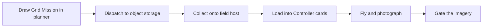
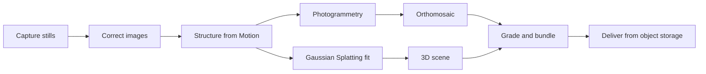

# Drone Survey

Turns drone footage of a Site into finished visual deliverables clients pay for:
Orthomosaic maps and explorable 3D scenes (Gaussian Splatting). Phase 1 sells
those two; a 3D Timelapse across repeat visits comes later.

The primary goal is automation. Manual work is client contact, driving, and
flying. Everything else — mission planning, controller prep, go/no-go checks,
processing, quality control, delivery, retention — runs itself, with a quality
gate on every automated step.

> [!NOTE]
> Start with [`CONTEXT.md`](CONTEXT.md) for vocabulary (capitalised terms are
> glossary terms) and [`docs/design.md`](docs/design.md) for the system spec.

## Features

- Planner (`web/`) draws a Grid Mission on a map; the same maths lives in the
  writer so the preview never lies about photo count or flight time.
- Mission Specs travel planner → object storage → field host → Controller over
  MTP. Loads are all-or-nothing with read-back verification and per-card backup.
- Pipelines as declarative Manifests (`pipeline/`) of shared Nodes (`nodes/`):
  Orthomosaic, Gaussian Splatting, bundle/publish, retention.
- Every Node carries a verification bar; the seams carry end-to-end tests.

## How it works

Mission path, planner to flight:



Capture to client delivery:



Each arrow is a Node with declared inputs and outputs; each box carries a
quality gate. A Manifest wires Nodes into one Pipeline per deliverable, and
the Runner executes it. Detail lives in [`docs/design.md`](docs/design.md).

## Installation

Prerequisites: Python 3.11, Node 24, `jmtpfs` (field host only).
- Minimum Python version for scripts/mission (M8 floor): 3.11

```bash
git clone https://github.com/Akamel01/drone-survey.git
cd drone-survey
python3 -m venv .venv && source .venv/bin/activate
cd web && npm install
```

Heavy tools (`tools/`, COLMAP, OpenSplat, openMVS) and data directories
(`00_raw/` … `09_exports/`) are local-only and never committed.

## Quickstart

Prove the whole mission path without hardware:

```bash
python3 scripts/mission/e2e_test.py
python3 scripts/mission/collect.py --selftest
python3 scripts/mission/load.py --selftest
```

Run the planner:

```bash
cd web && npm run dev
```

See what is Dispatched and waiting (needs B2 read credentials, below):

```bash
python3 scripts/mission/collect.py --list
```

## Mission status

The **Mission status** section in the planner sidebar shows every mission and
acts on it — from any browser, after a refresh or restart:

- **The passphrase field** (below the map, next to Dispatch) holds the shared
  dispatch secret, typed once per browser and stored only there. It is not a
  DJI or Wayfinder account. Everything the tab does is gated by it.
- **States:** Draft (unsent working copy) → Dispatched (in the store; the RC
  need not be connected) → Queued (waiting behind an earlier dispatch) →
  Collected (on the host) → Loaded (on the Controller, with the exact
  way finder card names and waypoint counts).
- **Actions:** save the current plan as a draft, Dispatch a draft (works with
  the RC disconnected — the host picks it up on the next plug-in), delete a
  draft (a Dispatched Spec is immutable and can only be superseded), edit a
  draft back into the planner.
- **Freshness:** information trails the host by ~1–2 minutes. Every row shows
  how old its information is; a mission waiting over 15 minutes suggests the
  Controller is unplugged or the host is quiet.

## Configuration

Backblaze B2 credentials live in `~/.config/wayfinder/` (`b2-write`, `b2-read`,
`b2-delivery`, `dispatch`), mode 600, created by prompting — keys never touch
shell history:

```bash
bash scripts/save_b2_credentials.sh b2-read
```

The web app needs `DISPATCH_SECRET`, `B2_KEY_ID`, `B2_APP_KEY`, `B2_BUCKET`
(Vercel env on deployed, `vercel env pull` for local dev).

Accounts add nine required variables, also in the Vercel environment. They are
validated at start-up: a deployment missing any of them keeps building and
running, and the auth endpoints answer 503 naming what is missing.

- `DATABASE_URL` — Postgres connection string (Neon in production).
- `BETTER_AUTH_SECRET` — signs sessions.
- `BETTER_AUTH_URL` — this deployment's public base URL.
- `OAUTH_PROXY_SECRET` — shared OAuth-proxy secret; the same value in
  production, previews and local.
- `GOOGLE_CLIENT_ID` — Google OAuth client id.
- `GOOGLE_CLIENT_SECRET` — Google OAuth client secret.
- `GITHUB_CLIENT_ID` — GitHub OAuth client id.
- `GITHUB_CLIENT_SECRET` — GitHub OAuth client secret.
- `OWNER_EMAIL` — the operator's email; that Account gets the operator
  Workspace and the admin role.

Local setup — `pglite://`, migrations, tests, evidence screenshots — is in
[`web/README.md`](web/README.md).

## Layout

- `00_raw/` … `09_exports/` — capture-to-deliverable data flow (gitignored).
- `nodes/` — one named pipeline step each, shared across Manifests.
- `pipeline/` — declarative Manifests wiring Nodes into deliverables.
- `scripts/mission/` — Spec → KMZ writer, Collect, Load, end-to-end test.
- `web/` — Next.js planner and Dispatch API.
- `docs/` — `design.md` (spec), `adr/` (decisions), `research/`, `field/`
  (flight checklists), `business/` (pricing, contracts, storage setup).
- `tools/` — locally built engines (gitignored).

## Development and testing

```bash
python3 scripts/mission/e2e_test.py   # planner maths → writer → KMZ seams
```

CI (`.github/workflows/mission.yml`) runs the end-to-end test on every push
touching `scripts/mission/**` or `web/lib/**`. New behaviour ships with an
offline `--selftest`; a check that needs hardware is an operator procedure in
`docs/field/`, not a script that pretends.

## Contributing

Solo build. Before changing anything, read `CONTEXT.md`, `docs/design.md`,
and the ADRs under `docs/adr/` (including revision sections — several record
a measurement overturning the original argument). Tracked work lives in
GitHub issues; open an issue before a branch.

## License

Private repository. All rights reserved.
