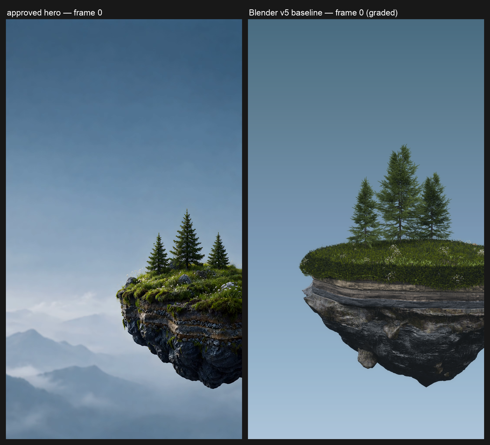
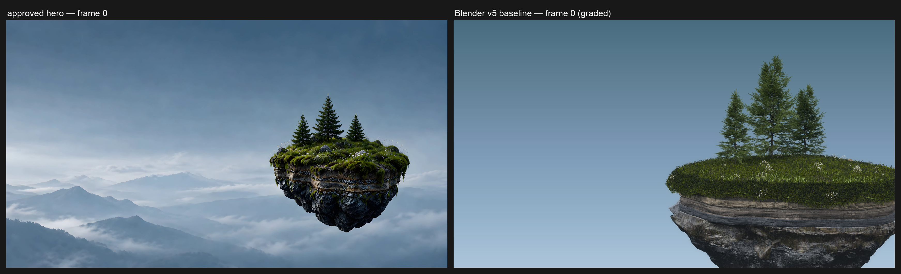
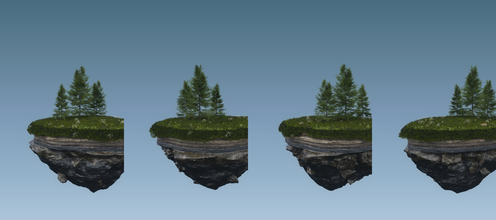

# Hero vs Blender v5 baseline — measured sheet, scorecard and render cost — 2026-09-27

Ticket [#222](https://github.com/Akamel01/drone-survey/issues/222) (wayfinder task), parent map
[#219](https://github.com/Akamel01/drone-survey/issues/219). Branch `research/hero-blender-baseline`
(base `origin/main @ 7275ddb`).

This is the #222 deliverable: the existing procedural island (`scripts/hero/hero.py`, the dropped
v1–v5 pass — `docs/ui-theme/hero-pipeline.md:362`: "Promising, but needed 5–10 more passes to reach
the generated look") re-rendered at the approved hero's framings, graded with the hero's own grade,
and scored with the look spec's own `measure.py` against the look spec's measured hero targets.
**VIEW items only; TOOL artefacts are reported as confirmed TOOL, not chased.** Every number below
is sourced to `.autoforge/execution/M1.md` (§) or `.autoforge/execution/M1-data/**`; nothing was
re-rendered for this document.

**How the numbers were obtained.**

| | |
|---|---|
| Date | 2026-09-27 |
| Machine | `akamel-linux` — RTX 4070 SUPER 12 GB; GPU read `1503 MiB, 0 %` before every launch (M1 §0); Blender **5.2.2 LTS** build `d13f752e3b9c` 2026-09-15 |
| Scene under test | `scripts/hero/hero.py` sha256 `cced733799eddb568ca93ca7e02ddb0296df0ac0b0d6043d8d4f85963b0f855f`, verified before and after all runs (M1 §0) |
| Hero masters | tall sha256 `8fb54b550875cdf0bc46c240bb5a6868b2f039781ed8de0cfdacdb4493abec81`, wide `aba25781e62700cce31a490a6872ab00b57083459a0cceaaa1e48fd2b80cc844` (M1 §1 = look-spec §1) |
| Hero frame 0 | tall `0c9d67f2…105d60`, wide `de1c1f08…2d3302` (M1 §1 = look-spec §2.1) |
| Grading | `nodes/grade/grade.py` — self-test proven "pixel-identical to scripts/hero/grade.py" (verbatim port of `scripts/hero/grade.py:5-22`); plate `fixtures/showcase/sky-plate.png` sha256 `0e29d8a1941247df7a7349a5aa77e6e877776889a411d52e3108b88fa086e535` (M1 §5, §8) |
| Measurement | look-spec `measure.py` fetched from `origin/research/hero-look-spec`, sha256 `26f93fce4bb101c7ff07a1f446636d8bddf51cc36c0fed88b1766c661a495fe7`; hero reference rows = s0 slice of look-spec `measurements.csv` (`.autoforge/execution/M1-data/hero-measurements-s0.csv`, 322 rows) (M1 §9) |
| Local tools | afvenv Python 3.14.7, numpy 2.5.3, Pillow 12.3.0 (look-spec §1:33); ffmpeg/ffprobe 9.0.1 (M1 §0) |
| Evidence log | `.autoforge/execution/M1.md` (348 lines) + `.autoforge/execution/M1-data/**` (16 measure JSONs, 17 logs, staged graded frames, sha256 manifest); independently reviewed in `.autoforge/reviews/M1.md` (APPROVED_WITH_NOTES) |

## 1. The answer

v5 at the hero's framings, graded with the hero's own grade, is **not close** to the approved hero.
The headline gaps are structural and measurable:

1. **Sky** — a flat 2D plate, stretched 16:9→9:16 for tall (`grade.py:8`; N9), with no cloud
   structure or sun glow. Its measured ramp is about **half** the hero's steepness (R slope 0.965 vs
   1.93 levels/%H) and its 0.65 H horizon is far darker (`#87A5BE` vs hero `#B5C0CF`).
2. **Depth stack** — the scene contains no mountains, valley mist or volumetric atmosphere at all;
   behind the island the pixels are plate + screen-space grade. Wide far-band contrast is degenerate
   (0.1503 levels; 4i cloud metrics not producible).
3. **Grade** — the graded baseline **lifts blacks** (tall p1 22.5, `lifted=1`) where the hero is not
   (p1 2.97), and adds a lens glow (`GLOW = 0.2`) the look spec says not to chase.
4. **Materials** — the island is lighter and greyer than the hero's strata: soil `#3B3B3C` vs
   `#1B1E24`, basalt `#171B1E` vs `#090C11`; the pebble stripe collapses to 0.3 % vs 4.1 % of island
   pixels (tall).
5. **Framing** — the wide baseline island is ≈1.7× the hero's angular size and bottom-clipped
   (INFERRED); `hero.py` has one fixed portrait camera and no recomposition path.

**Render cost (first real 4K numbers):** tall **26.862 s/frame**, wide **25.562 s/frame** at 128
samples, OIDN, **4458 MiB** peak; OptiX denoise is 1.95× faster (13.795 s) at +1424 MiB. A 40 s turn
extrapolates to **8.95 h** (tall, 1,200 frames at 30 fps) / **17.91 h** at 60 fps; a 243-frame
Showcase turn is 1.81 h. Cost lands inside the techniques doc's 20–60 s/frame estimate — **the look,
not the cost, is the gap**.

## 2. Reproduce

### 2.1 Hero masters → frame 0

```bash
scp akamel-linux:~/hero3d/web4k/hero-tall-4k120-hevc.mp4 masters/     # then sha256 both masters
scp akamel-linux:~/hero3d/web4k/hero-wide-4k120-hevc.mp4 masters/     # hashes in the table above
git show origin/research/hero-look-spec:docs/research/hero-look-spec/extract_frames.sh > extract_frames.sh
#   sha256 b32881ee3ed8ff4b3e4fd170ef79e46cf705565791bed702b3275c1d736343f5
MASTERS_DIR=$S/masters OUT_DIR=$S/hero-frames bash extract_frames.sh   # 16 frames; frame-0 hashes re-checked
```

### 2.2 The 4K renders (driver approach)

`hero.py` is loaded first so `build()` runs and `MODE = none` skips its preview; `driver.py` then sets
per-shot resolution, samples, denoiser, azimuth, and (wide only) camera `shift_x`. One process per
run, one render at a time, 5 Hz VRAM sampling throughout (`run-series.sh`, M1 §2):

```bash
# One process per run (run-series.sh:4-5, 10-11, verbatim; VRAM sampled at 5 Hz alongside):
MODE="$1"; TAG="$2"; AZ="${3:-0}"; WSX="${4:-}"
D="$HOME/hero3d/baseline222"
~/blender-5.2.2-linux-x64/blender -b --factory-startup --log-level debug --log "render" --python-exit-code 1 \
  -P "$HOME/hero3d/hero.py" -P "$D/driver.py" -- "$MODE" "$D" "$AZ" $WSX --cycles-print-stats > "$D/$TAG.log" 2>&1
# Resolved for the baseline series (M1 §6; series.log:761, and :1961 prints the default shift_x −0.12):  MODE=series  AZ=0  WSX unset
# Resolved for the corrected wide (wide2.log:372-373):                                                    MODE=wide    AZ=0  WSX=-0.26
```

- az000 = `IslandRoot.rotation_euler = (0, 0, 0)` (INFERRED mapping, §7).
- Tall = the hero.py portrait camera unchanged: lens 50, distance 17.5, elevation 8°, `shift_x
  −0.12`, `shift_y 0.09` (`hero.py:28-29`); resolution 2160×3840.
- Wide = same camera at 3840×2160 with **`shift_x = −0.26`**, `shift_y 0.09` unchanged (camera-only,
  D3); Blender AUTO sensor fit widens the horizontal field (`wide2.log:372` prints `WIDE shift_x=-0.26`).
- `film_transparent`, AgX Medium High Contrast, OptiX device selection left exactly as `build()` sets
  them (`hero.py:543, 548-554`); PNG RGBA out (`driver.py:29-31`); no hero.py edits.

### 2.3 Grading

Self-test before any grading (M1 §8; reproduced by the M1 reviewer):

```
  frames-wide 7 in/7 out  frame 0 pixel-identical  first==last ok  rerun byte-identical
  frames-tall 7 in/7 out  frame 0 pixel-identical  first==last ok  rerun byte-identical
  wide 400x300  pixels sha256 4244c4e9…  hero-identical  cli png sha256 04fc423f…
  tall 300x400  pixels sha256 8b4ac396…  hero-identical  cli png sha256 6a676c13…
self-test ok: sizes match, RGB opaque (alpha consumed), 2 runs byte-identical, pixel-identical to
scripts/hero/grade.py, frozen CLI exercised twice
```

Pair grading of the two baseline 4K frames over the repo plate:

```bash
afvenv/bin/python nodes/grade/grade.py --in-wide $S/renders/4k/wide-128.png \
    --in-tall $S/renders/4k/tall-128.png --sky fixtures/showcase/sky-plate.png \
    --out-wide $S/renders/4k/wide-128-graded.png --out-tall $S/renders/4k/tall-128-graded.png
# tall-128-graded.png sha256 fc8548fd… ; wide-128-graded.png sha256 ce0e46ea…
# Hash provenance: .autoforge/execution/M1-data/sha256-evidence.txt, keys renders/4k/tall-128-graded.png
# and renders/4k/wide-128-graded.png; staged copies: M1-data/staged/tall-s0-f0.png / wide-s0-f0.png
```

The four v5 native 608×1080 renders were graded with the original `scripts/hero/grade.py`:
`afvenv/bin/python $S/grade.py $S/renders/v5-native $S/sky-plate.png` → `sheet.jpg`, `hero.jpg`
(M1 §5).

### 2.4 measure.py invocations

16 invocations, one per attribute per framing, on the staged graded 4K frames (single-frame
provenance caveats in §7):

```bash
afvenv/bin/python $S/measure.py --frames $S/staged/<framing> --framing <framing> \
  --frame s0 --attribute <4a..4h>
```

Output JSONs: `.autoforge/execution/M1-data/measure-{tall,wide}-4{a..h}.json`. Full-CSV mode was
**not** run (needs 8 frames, stamps the hero's master hash, and its island-bbox gate would exit 2 on a
single frame — M1 §9); 4i was **not** run (needs 8 frames and a cloud volume the scene does not have).

## 3. Figures







Panel spec (M1 §10): `side-by-side-tall.png` 1992×1809, panels 960×1707, 1.75 MB, sha256
`6c7c471e…05e552`; `side-by-side-wide.png` 3486×1062, panels 1707×960, 1.86 MB, sha256
`c25e1e4f…8339ef7`; `v5-native-four-angles.png` 2026×900, 0.96 MB, sha256 `8c578ae9…58beb0a5`.
The raw 4K graded stills stay in scratch (`$S/renders/4k/`).

## 4. VIEW scorecard

Hero target = the look spec's measured value (look-spec §/table; the hero's numbers are means over
s0–s7 unless a row says otherwise). Baseline = the single graded frame s0 from M1-data JSONs; the
baseline is one frame, so it cannot produce the look spec's union or mean rows. TOOL rows are
reported to confirm they are **not** chased.

| VIEW item | hero target (look-spec §) | baseline measured (M1 JSON value) | gap verdict |
|---|---|---|---|
| Sky gradient (4a) | tall ramp `#24384A`→`#C4CCD5` (0.02→0.68 H); slopes R 1.93 / G 1.62 / B 1.38 levels/%H; R² ≥ 0.97 (§4a, §5) | tall `#2C414E`→`#8AA8C0`; slopes R 0.965 / G 0.890 / B 1.016; R² 0.998/0.996/0.992; 0.65 H horizon `#87A5BE` (`measure-tall-4a.json`); wide anchors identical through 0.55 H, 0.68 H clamped `#4D5F70` (`measure-wide-4a.json`) | **Gap** — ramp ≈half the hero's slope and a much darker horizon; measured on plate+grade, not the Blender world (§7) |
| Haze (4a) | HorizonHaze tall `#B9C3D1` / wide `#B8C5D2`; sits near `--sky-low`, ΔE ≈22 vs `--haze` (flagged for sign-off, §4a/§5) | tall `haze_hex #7990A3`, ΔE vs `--haze` **6.91**; wide `#7E9CB7`, ΔE **13.19** (`measure-{tall,wide}-4a.json`) | **Gap** — baseline haze sits almost on the dark `--haze` token where the hero is far from it; screen-space, not scene haze |
| Aerial-depth falloff (4b) | D2/D1 0.05–0.17, D3/D1 0.04–0.06; S D2/D1 0.38–0.43, S D3/D1 0.26–0.32 (§4b, §5) | tall: D2/D1 **0.156**, D3/D1 **0.550**, S D2/D1 **1.079**, S D3/D1 **0.957** (D2/D3 are plate-only pixel values); wide: D2/D3 contrast 0.1503, falloff ratios 0.0102 — **degenerate/N/A** (`measure-{tall,wide}-4b.json`) | **Gap** — D3/D1 ≈13× the target band and saturation does not fall off at all; wide N/A (uniform plate) |
| DOF (4e) | LapVar D1/D2 365.6 tall / 72.8 wide; implied σ D2 2.45 px, D3 2.61 px (§4e, §5) | tall: ratio **84.05**, σ D2 **1.607 px**, σ D3 **0.600 px** (plate/edge-dominated); wide: LapVar 0.048 / 0.050, ratio 1.7e4 — **degenerate/N/A** (`measure-{tall,wide}-4e.json`) | **Measurement-limited** — no far structure to blur; not a scene DOF read (wide N/A) |
| Shadow lift (4d) | tall p1 **2.97**; not lifted (`p1 ≥ 8` = lifted) (§4d; §6 "the basalt is not lifted") | tall p1 **22.51**, `lifted=1` (min 21.29, p50 46.15); wide p1 **23.15**, `lifted=1` (`measure-{tall,wide}-4d.json`) | **Gap** — graded output is lifted where the hero is not (`grade.py` LIFT) |
| Palette (4g) | union medians tall: turf `#283017` (0.137), moss `#384117` (0.136), soil `#1B1E24` (0.411), pebble `#212111` (0.041), basalt `#090C11` (0.275) (§4g, §5) | tall per-frame: turf `#333E21` (0.164), moss `#2E3617` (0.163), soil `#3B3B3C` (0.348), pebble `#171C21` (**0.0031**), basalt `#171B1E` (0.232); **union s0–s7 targets N/A** (`measure-tall-4g.json`) | **Gap** — island lighter/greyer, pebble stripe collapsed; union unproducible from one frame |
| Conifers (4h) | tall dark-area **28.2 %**, edge **0.352**; wide **12.3 % / 0.165** (§4h, §5) | tall **31.62 % / 0.8102**; wide **35.52 % / 0.5583** (`measure-{tall,wide}-4h.json`) | **Gap** — edge density 2.3×/3.4×; region-content caveat (§7) |
| Layering | sharp island front; hazed mountains + valley mist behind; flat sky behind both; island always on the right (§5) | island present; behind it only plate: wide 4b D2/D3 0.1503 flat; tall 4b D2/D3 2.01/7.08 (plate-only); 4e σ D2/D3 1.61/0.60 px (`measure-{tall,wide}-4{b,e}.json`) | **Gap** — the mountain/mist layer does not exist in the scene |
| TOOL — bloom (4c) | no resolvable halo; r50 ≈0.8 px sub-pixel edge overshoot; do not add (§4c, §5) | tall r50 **1.05 px**, peak/bg 2.55; wide r50 **262.6 px**, peak/bg 1.19; measure.py's own note: "edge-limited: peak sits on the island silhouette, not sky; TOOL" (`measure-{tall,wide}-4c.json`) | **Confirmed TOOL, not chased** |
| TOOL — grain (4f) | ≤ ~0.4 level, effectively none; do not add (§4f, §5) | tall σ 0.124–0.134; wide σ 0.167–0.178 (high-pass, native 4K; `measure-{tall,wide}-4f.json`) | **Confirmed TOOL, not chased** — already at/below the hero level |
| TOOL — micro-contrast / edge crispness (4e sharp end) | D1's acutance is Real-ESRGAN's — match the DOF ratio, not D1's micro-acutance (§4e C2, §5) | tall LapVar D1 **527.54**, wide **803.07**; measure.py's note on the σ rows: "sharp end is TOOL" (`measure-{tall,wide}-4e.json`) | **Confirmed TOOL, not chased** |
| Clouds (4i) | band y 84.1 %H; texture zero 432/768 px; drift at detection floor (§4i) | — | **N/A** — 4i needs 8 frames and a cloud volume; the scene has neither (M1 §9, §7 H2) |
| 4g union targets | union over s0–s7 (§4g) | — | **N/A** — a single frame cannot produce union rows (marked in M1 §9) |
| Wide 4b / 4e D2/D3 | far-band falloff / DOF (§4b, §4e) | — | **N/A** — regions contain no structure (uniform plate) (M1 §9) |

## 5. Gap list by category

Each item: statement + evidence. "§/M1" = `.autoforge/execution/M1.md`; JSON paths are under
`.autoforge/execution/M1-data/`.

### Materials

- **The island palette is lighter and greyer than the hero's strata.** Tall per-frame medians vs hero
  union medians (§4g): soil `#3B3B3C` (S 0.123 / V 67.3) vs `#1B1E24`; basalt `#171B1E` (V 30.2) vs
  `#090C11` (V 17.5); turf `#333E21` vs `#283017`; moss `#2E3617` (S 0.499) vs `#384117` (S 0.639).
  Evidence: `measure-tall-4g.json` (`palette_*_median_hex`, `meanS`, `meanV`) vs look-spec §4g.
- **The pebble stripe is effectively absent in tall and wrong-coloured in wide.** Tall share 0.0031
  vs hero 0.041 (13× thinner; `measure-tall-4g.json palette_pebble_share`). Wide pebble reads
  `#4A4740` (S 0.151 / V 76.9) vs hero wide `#2D2C10` (S 0.574 / V 53.4) — light grey where the hero
  has a dark olive stripe (`measure-wide-4g.json` vs look-spec §4g).
- **Wide island strata read grey:** wide soil `#494948` (S 0.101 / V 80.7), basalt `#262727` (V 41.1)
  vs hero wide basalts `#0A0B0F` (V 16.7) (`measure-wide-4g.json`, look-spec §4g); the lifted blacks
  below contribute.

### Light

- **Blacks are lifted in the graded baseline; the hero's are not.** Tall p1 **22.51** (`lifted=1`) and
  wide p1 **23.15** vs hero p1 2.97 / 2.72 (`measure-{tall,wide}-4d.json`; look-spec §4d, §6). Cause
  in code: `scripts/hero/grade.py:5,21-22` / `nodes/grade/grade.py:20,38-39` — `LIFT = 0.04` blend
  toward `(74, 98, 116)`.
- **A glow layer is added where the hero has no resolvable bloom.** `GLOW = 0.2` bright-pass add
  (`grade.py:17-19`); the baseline's island-neighbourhood peak/background ratio measures **2.55**
  tall vs hero 1.41 (`measure-tall-4c.json` vs look-spec §4c). The look spec's TOOL list says
  explicitly not to add bloom (§5) — the row above records it as TOOL and not chased.

### Haze

- **Horizon haze is too dark.** Baseline tall haze region `#7990A3` (ΔE vs `--haze` **6.91**), wide
  `#7E9CB7` (ΔE **13.19**) vs hero `#B9C3D1` / `#B8C5D2` (ΔE ≈22 vs `--haze`, i.e. much lighter, near
  `--sky-low`) (`measure-{tall,wide}-4a.json`; look-spec §4a/§5). Note the look spec flags that ΔE
  ≈22 token divergence for shared-token sign-off — the baseline being *closer* to `--haze` than the
  hero is itself a divergence from the hero.
- **Haze does not produce aerial falloff.** Tall saturation ratios S D2/D1 **1.079** / S D3/D1
  **0.957** against hero targets 0.38–0.43 / 0.26–0.32, and tall D3/D1 contrast **0.550** against
  0.04–0.06; the far band is *more* textured than the mid band, not less
  (`measure-tall-4b.json`; look-spec §4b). Wide falloff is degenerate (0.0102; uniform plate).

### Trees

- **Conifer silhouettes are too dense-edged and too dark over their band.** Tall dark 31.62 % / edge
  0.8102 vs hero 28.2 % / 0.352; wide 35.52 % / 0.5583 vs 12.3 % / 0.165 (`measure-{tall,wide}-4h.json`;
  look-spec §4h). Region-content caveat: the hero's `ConiferBand` over the baseline catches island-top
  moss/turf (tall) and canopy (wide), not a tree-against-sky silhouette (M1 §9) — the edge-density
  multiple is the cleaner signal.

### Clouds

- **No cloud volume exists in the scene.** `build()` contains no volume/cloud/VDB node (nothing
  matches `volume|cloud|vdb` in `scripts/hero/hero.py`; build is `hero.py:430-555`). This is why H2
  was not run (M1 §7) and 4i is N/A (M1 §9).
- **The visible sky carries no cloud structure.** The plate is a flat gradient whose own provenance
  says it "does not carry the HDRI's cloud structure or sun glow" (`fixtures/showcase/PROVENANCE.md:92-94`);
  the hero's cloud/mist band sits at 84.1 %H with texture zero 432 px (tall) — the baseline has
  nothing at that band to measure (M1 §9; look-spec §4i).

### Scale

- **Wide island ≈1.7× too large and clipped.** Chosen probe bbox x 0.478–1.000, y 0.136–1.000
  (centre 0.739, 0.568) vs hero wide union bbox x 0.586–0.950, y 0.292–0.858 (look-spec §3:159); right
  edge lands on the frame edge and the underbelly is cut by the 16:9 bottom (M1 §4). Island angular
  size ≈22.5° vs hero ≈13° — **INFERRED** from the bbox fractions and the AUTO-fit FOVs (M1 §4). The
  residual is a gap, not a fixed value (D3 forbids more than camera shift).
- **Tall island scale was not independently measured**; the tall framing carries by aspect (both
  9:16) and `side-by-side-tall.png` is the evidence (see §7).

### Structural (code-level)

- **No wide camera / recomposition path.** `hero.py` builds one fixed portrait camera (lens 50, dist
  17.5, elev 8°, `shift_x −0.12`, `shift_y 0.09` — `hero.py:28-29, 529-538`) and sets no `sensor_fit`;
  the two approved masters are independent generations (discovery report Q2), so one camera cannot
  serve both framings. The wide baseline needed an inferred camera shift (`shift_x −0.26`) and still
  misses composition (M1 §4).
- **The sky is a 2D plate, stretched.** `grade.py:8` resizes the 3840×2160 plate to the render size;
  tall is a 16:9→9:16 stretch, wide an identity resize (N9, M1 §8). `PROVENANCE.md:92-98` records the
  debt: flat gradient, brightness matched to stills, not a rendered/tone-mapped sky.
- **Grade semantics diverge from the look spec.** `grade.py:5` adds `HAZE, GLOW, LIFT = 0.09, 0.2,
  0.04`; measured consequence: lifted shadows (`lifted=1`) and the added glow. Look spec §5 TOOL:
  "Do not add bloom", and §6: blacks "are not lifted" — the dreamy read comes from haze and DOF.
- **Post haze, not scene haze; no volumetric atmosphere.** No volume shader in `build()` (grep
  empty; `hero.py:430-555`); the only "haze" is the screen-space composite of a blurred sky with a
  vertical amount gradient (`grade.py:9-15`), so it cannot respond to the turning geometry except
  through the island's alpha.
- **No cloud volume at all** (same grep) — see Clouds; H2's reason (M1 §7) and 4i's N/A (M1 §9).

## 6. Render cost

All 4K runs are 2160×3840 (tall) or 3840×2160 (wide), az000, `use_denoising=True`, PNG RGBA. Wall =
`time.monotonic()` around `render(write_still=True)`; report `Time`/`Saving` from
`--log-level debug --log render`; peak VRAM = max over `[BEGIN−0.5 s, END+1.0 s]` of the 5 Hz
samples (N-4 correction: counts are **77–170**, not 130–170). GPU gate `1503 MiB, 0 %` before every
launch; one render at a time; nothing else was killed (M1 §0). Each run pays a 380×675 warm-up shot
first (series: 7.169 s, `series.log:379`) because the first render in a session pays the cold OptiX
kernel build and texture decode — the timed series is therefore the warm steady state; the no-repeat
rationale and warmup/preview parity (≤1 level) are in M1 §12.5 (N2).

| run | config | samples | denoiser | wall s | report Time (Saving) | peak VRAM | 5 Hz n | log |
|---|---|---|---|---|---|---|---|---|
| series | **tall 2160×3840 (baseline)** | 128 | OIDN | **26.862** | 00:26.85 (00:00.38) | **4458 MiB** | 141 | `series.log:1153-1154` |
| wide2 | **wide 3840×2160 (baseline, shift_x −0.26)** | 128 | OIDN | **25.562** | 00:25.56 (00:00.39) | **4458 MiB** | 130 | `wide2.log:762-763` |
| series | tall @64 (H1) | 64 | OIDN | 22.374 | 00:22.37 (00:00.39) | 4458 MiB | 119 | `series.log:758-759` |
| series | tall @256 (H1) | 256 | OIDN | 32.545 | 00:32.53 (00:00.39) | 4458 MiB | 170 | `series.log:1568-1569` |
| series | tall @128 OptiX (H4) | 128 | OptiX | 13.795 | 00:13.78 (00:00.38) | 5882 MiB | 77 | `series.log:1958-1959` |
| series | wide @128 shift_x −0.12 (superseded) | 128 | OIDN | 27.070 | 00:27.06 (00:00.40) | 4460 MiB | 139 | `series.log:2352-2353` |
| h3cache | tall @128, `.tx` cache present (H3) | 128 | OIDN | 29.018 | 00:29.01 (00:00.39) | 4256 MiB | 148 | `h3cache.log:1236-1237` |
| series | warm-up 380×675 | 64 | OIDN | 7.169 | — | 4172 MiB | 43 | `series.log:379` |

**Timing cross-check (N-1 corrected):** the report's `Time` line agrees with the wall clock to
≤0.015 s (e.g. `00:26.85` vs 26.862 s); `Saving` is the file-write portion *inside* that number, so
`Time + Saving` must not be added (27.23 s would be 0.37 s over the wall). Warm-ups also ran for
`wide2` (7.126 s, `wide2.log:370`) and `h3cache` (7.723 s, `h3cache.log:612`); their peak VRAM was
not published in M1 (warm-ups are 380×675 and not part of the cost curve).

**H1 — sample curve (framing: tall, N10).** 64 → 128 → 256 samples = 22.374 → 26.862 → 32.545 s
(+4.49 s, then +5.68 s); peak VRAM 4458 MiB at all three (5 Hz sampling cannot resolve smaller
differences). The curve is shallow — fixed cost + denoiser dominate.

**H3 — texture cache.** `maketx` took `real 0m3.799s` (`maketx.log`), 37 `.tx` tiles, 487 MB assets
dir; the cached render was 29.018 s / 4256 MiB vs 26.862 s / 4458 MiB: **−202 MiB (−4.5 %) VRAM,
+2.16 s (+8 %)**. Caveat: the cached render is visibly different at the foliage — alpha-cut needles
render spikier/denser; 5.5 % of frame pixels differ in alpha and alpha-masked RGB differs >8 levels
on 26 % of island pixels (M1 §7, `$S/figs/h3-compare.png`). The `.tx` path changes the image; it is
not bit-identical output.

**H4 — OIDN vs OptiX.** Same tall @128 frame: OIDN 26.862 s / 4458 MiB vs OptiX 13.795 s / 5882 MiB
— **1.95× faster, +1424 MiB**. Fixed 1:1 crops (`M1-data/h4-crops.png`): no structural loss; OptiX is
mildly smoother on the finest rock/needle texture, OIDN keeps a little more micro-detail; neither
adds grain/bloom.

**H2 — not run.** `hero.py` builds no cloud volume anywhere in `build()` (`hero.py:430-555`; grep for
`volume|cloud|vdb` is empty), so a fabricated bounded cloud box would measure a different scene than
the baseline (plan D6, M1 §7). The techniques doc's volume rows therefore remain untested here.

**H5 — extrapolation (arithmetic only; no turn was rendered).** Steady-state measured s/frame ×
frame count; a 40 s turn is 1,200 frames at 30 fps (2,400 at 60 fps, 4,800 at 120 fps); the Showcase
turn is 243 frames (`nodes/grade/grade.py:49`). All cells **extrapolation**:

| config | 1,200 frames (30 fps, 40 s turn) | 2,400 frames (60 fps) | 4,800 frames (120 fps) | 243-frame Showcase turn |
|---|---|---|---|---|
| tall @128 OIDN | 32,234.4 s = **8.95 h** | 64,468.8 s = **17.91 h** | 128,937.6 s = 35.82 h | 6,527.5 s = **1.81 h** |
| wide @128 OIDN | 30,674.4 s = 8.52 h | 61,348.8 s = 17.04 h | 122,697.6 s = 34.08 h | 6,211.6 s = 1.73 h |
| tall @128 OptiX | 16,554.0 s = 4.60 h | 33,108.0 s = 9.20 h | 66,216.0 s = 18.39 h | 3,352.2 s = 0.93 h |

**Against the techniques doc's estimates** (`origin/research/hero-blender-techniques`,
§6 table + §6.1): the no-volume 128-sample row estimated 20–60 s/frame; measured 26.862 s (tall) /
25.562 s (wide) — inside it, low half. The "512 samples ≈ 4× the 128-sample row (roughly linear)"
line is **not** supported by H1: 256 samples cost 1.21× of 128, so the linear assumption already
overestimates at 2× (fixed cost + denoise dominate; the same shallow trend explains why the
4× row should be treated as an upper bound). Volume rows (45–120 s/frame; 2–8 min/frame) and the
"40–160 h per turn" figure depend on volumes and remain untested (H2 not run). Against discovery's
6.7–20 h range for that estimate: the OIDN rows (8.95 h tall, 8.52 h wide) fall inside it; the OptiX
row (4.60 h) falls below it.

## 7. Open questions and limitations

- **az000 = master frame 0 is INFERRED.** No mapping is documented anywhere; four quadrant renders
  were compared against `tall-s0-f0.png` and az000 matched the arrangement best (three-fir cluster
  left-top, big tree centre, light under-rock lower left). The hero is an independent generation, so
  no exact phase exists; residual error is bounded by half a quadrant (±45°) and cannot be quantified
  further (M1 §3, N14). All timed renders use az000.
- **Wide framing is INFERRED.** Same scene/camera with `shift_x −0.26`, `shift_y 0.09`; Blender AUTO
  sensor fit widens the horizontal field. The composition residual (island ≈1.7× too large,
  bottom-clipped — itself INFERRED) is a gap, not a settled measurement (M1 §4).
- **The measured sky is plate + grade, not the Blender scene.** The visible sky and all 4a/haze
  metrics come from the flat 2D plate composited by `grade.py:8` plus glow/haze/lift; the Blender
  world contributes only the island (film-transparent render) (N9; `PROVENANCE.md:65-68`). The tall
  plate is stretched 16:9→9:16; the wide resize is identity. The plate is calibration debt
  (`PROVENANCE.md:92-98`).
- **Single-frame measurement caveats.** Baseline values are frame s0 of one graded 4K still; hero
  targets are mostly s0–s7 means. 4g union rows are unproducible from one frame; the full-CSV mode
  and its S2 bbox gate were not run (8 frames required; the gate would exit 2) (M1 §9). On review,
  two measure.py reruns (tall 4a, wide 4g) and a grade rerun reproduced the M1-data values and
  staged frames byte-identically (`.autoforge/reviews/M1.md`, method notes).
- **Region-content caveats.** Tall 4b D2/D3 and 4e read plate/edge pixels, not scene structure; wide
  4b/4e D2/D3 regions contain no structure (values 0.1503 / 0.048–0.050, degenerate); 4h's
  `ConiferBand` over the baseline catches moss/turf (tall) and canopy (wide), not tree-against-sky
  (M1 §9). 4c wide r50 262.6 px is edge-limited by measure.py's own note — the peak sits on the
  island silhouette, not in sky — so it is not a sky-side halo.
- **H2 and 4i are not measurable in this scene** — no cloud volume exists; H2 documented not-run and
  4i not producible (M1 §7, §9).
- **H5 is extrapolation, not a measured turn** (linear in frames; no turn rendered). H3's texture
  cache changes foliage pixels (not bit-identical output) — an adoption-time risk, recorded here, not
  resolved (M1 §7).
- **v5 raw render hashes**: prefixes recorded in M1 §5; the full hash list lives in the local scratch
  dir `$S/renders/v5-native/` only, not in `sha256-evidence.txt` (N-2 correction). All other raw
  files and staged frames are hashed in `.autoforge/execution/M1-data/sha256-evidence.txt`.
- **Hero-side provenance caveats carry over**: the masters are post-Real-ESRGAN/RIFE/HEVC CRF 22
  (tool effects marked TOOL in the look spec, C2/C6); the licence status of the Higgsfield masters
  is unresolved (look spec C8).
- **Tall island scale was not independently bbox-measured**; the tall framing carries by aspect and
  `side-by-side-tall.png` is the visual evidence.

## 8. Sources

**M1 evidence (worktree):** `.autoforge/execution/M1.md`; `.autoforge/execution/M1-data/` —
`measure-{tall,wide}-4{a..h}.json` (16), `hero-measurements-s0.csv`, `sha256-evidence.txt`,
`logs/` (`series.log`, `wide2.log`, `h3cache.log`, `previews.log`, `wideprobe.log`, `h3_remap.log`,
`saveblend.log`, `maketx.log`, six `vram-*.log`, `argtest*.log`), `staged/{tall-s0-f0,wide-s0-f0}.png`,
`driver.py`, `run-series.sh`, `run-cache.sh`, `h3_remap.py`, `measure.py`, `extract_frames.sh`,
`h4-crops.png`; `.autoforge/reviews/M1.md`; `.autoforge/discovery/report.md` (Q2/Q4);
`.autoforge/plans/plan.md` (D1–D9); `.autoforge/execution/work-order.json` (M2 acceptance).

**Scratch (local, not committed):** `$S = /var/folders/c8/816q70zd5dvd48_49_npqj8w0000gn/T/opencode/hero-baseline-222/` —
`masters/`, `hero-frames/`, `renders/{v5-native,previews,4k}/`, `figs/`, `staged/`, `remote-logs/`.

**Branches:** `origin/research/hero-look-spec` — `docs/research/hero-look-spec.md` (§1–§7),
`docs/research/hero-look-spec/measure.py`, `measurements.csv`, `extract_frames.sh`;
`origin/research/hero-blender-techniques` — `docs/research/hero-blender-techniques.md` (§6, §6.1).

**Repo files:** `scripts/hero/hero.py` (sha `cced7337…`), `scripts/hero/grade.py`
(sha `8744a646…`), `nodes/grade/grade.py`, `fixtures/showcase/sky-plate.png`
(sha `0e29d8a1…`), `fixtures/showcase/PROVENANCE.md` (:63-98), `docs/ui-theme/hero-pipeline.md`
(:356-367, v1–v5 verdict), `docs/ui-theme/spec.md` (§3.1 tokens, §4.2 composition).

**Figures (this doc):** `docs/research/hero-blender-baseline/figures/{side-by-side-tall,side-by-side-wide,v5-native-four-angles}.png`
(M1 §10; hashes in `sha256-evidence.txt`).
