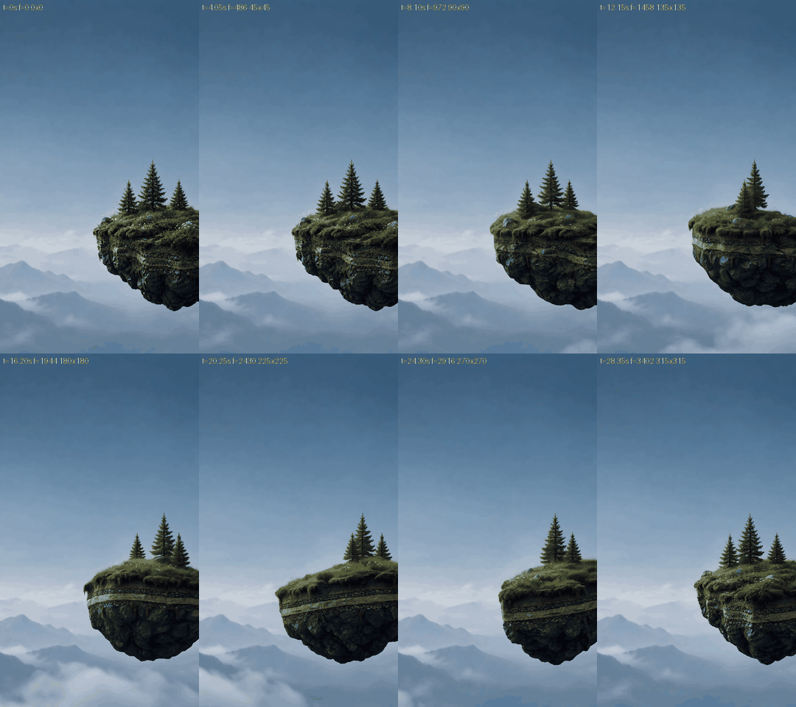
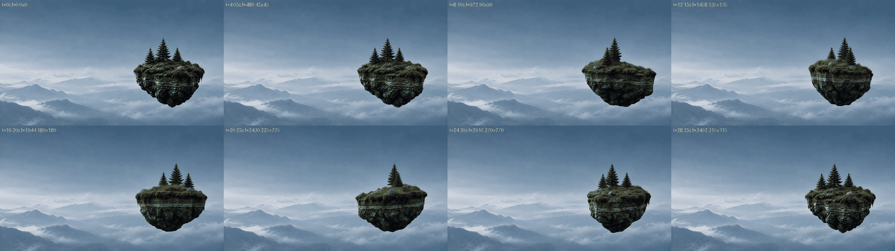
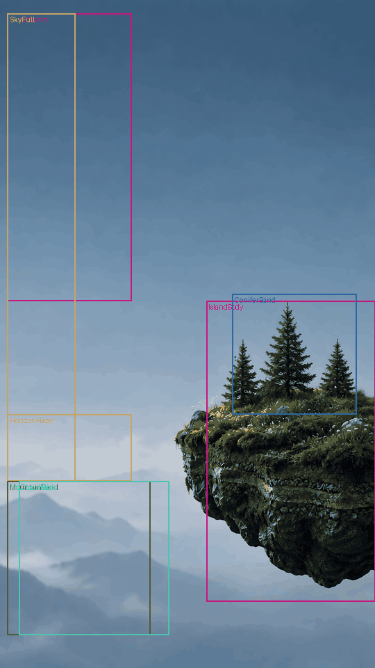
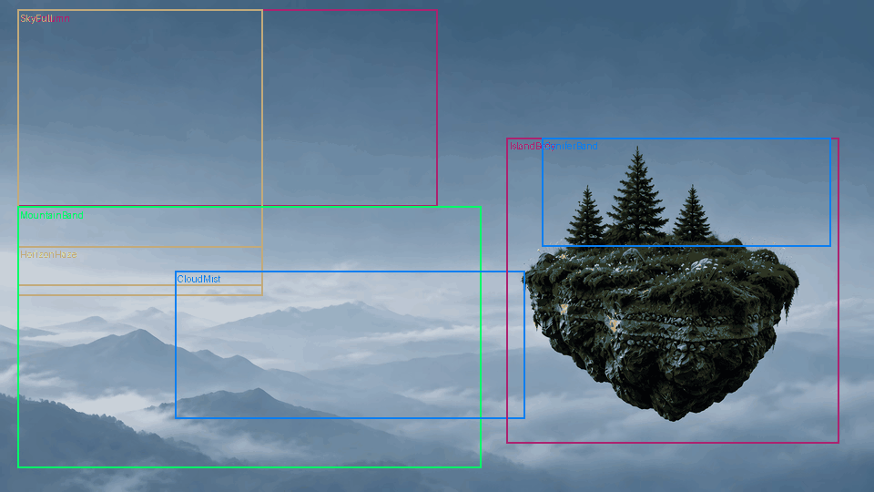
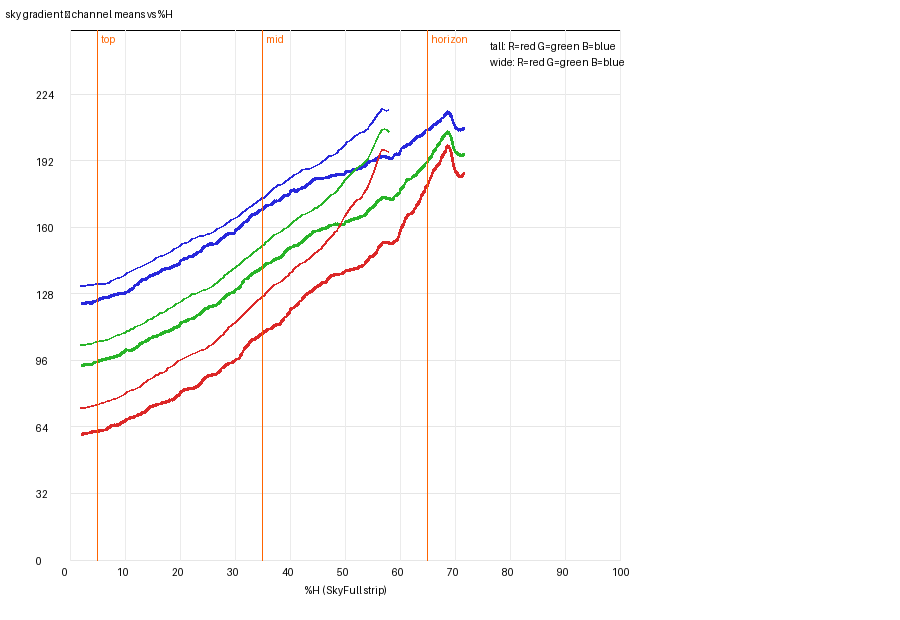
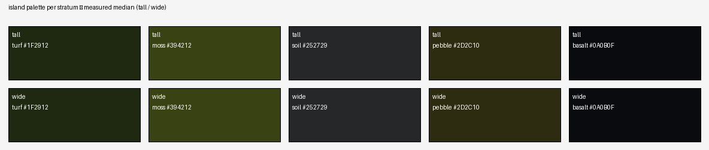

# What makes the approved hero read as dreamy — a measured look spec — 2026-09-27

Measured look spec of the approved Higgsfield hero (ticket
[#220](https://github.com/Akamel01/drone-survey/issues/220), map #219), produced so
that a Blender scene can be **checked against** the numbers rather than against an
impression. Every value below is a measurement of the two approved `4k120-hevc`
masters at native resolution, with the frames it was measured on; nothing is
estimated except where a row is marked **INFERRED**.

The operator approved the hero scene and #219's destination is a render "the
operator judges indistinguishable". This document does not set that threshold
(that is a human verdict, #219); it only defines *what* there is to compare.

> **How to read.** Section 3 defines the sample set and regions. Section 4 gives
> one table per attribute: value, units, frames, region, algorithm, caveat.
> Section 5 is the checklist a Blender scene is judged against, split into
> **VIEW** (part of the look) and **TOOL** (artefacts of the upscale/interpolator/
> encode — do not chase). Section 6 is what was measured, not measured, and
> contradicted. Section 7 is the caveat register C1–C9.

## 1. Setup and provenance

| | |
|---|---|
| Date | 2026-09-27 |
| Branch | `research/hero-look-spec` |
| Tall master | `hero-tall-4k120-hevc.mp4` — 2160×3840, 120 fps, 3888 frames, 32.400 s, hevc `yuv420p`, 31,444,118 B |
| Tall sha256 | `8fb54b550875cdf0bc46c240bb5a6868b2f039781ed8de0cfdacdb4493abec81` |
| Wide master | `hero-wide-4k120-hevc.mp4` — 3840×2160, 120 fps, 3888 frames, 32.400 s, hevc `yuv420p`, 22,810,035 B |
| Wide sha256 | `aba25781e62700cce31a490a6872ab00b57083459a0cceaaa1e48fd2b80cc844` |
| Master source | `akamel-linux:~/hero3d/web4k/` (hero-pipeline.md:319) |
| ffmpeg / ffprobe | `/opt/homebrew/bin/ffmpeg` 9.0.1, `/opt/homebrew/bin/ffprobe` 9.0.1 |
| Python | `/var/folders/c8/816q70zd5dvd48_49_npqj8w0000gn/T/opencode/afvenv/bin/python` — Python 3.14.7, numpy 2.5.3, Pillow 12.3.0 |
| Script | `hero-look-spec/measure.py` (stdlib + numpy + Pillow only) |
| CSV | `hero-look-spec/measurements.csv` — 2,736 rows, one per metric × framing × frame plus mean/frame_sd |

**Provenance chain.** The hero is generated (Higgsfield free trial) → debirded
(tall only) → **time-reversed** (tall only) → Real-ESRGAN `realesrgan-x4plus` ×4
then Lanczos to 4K → RIFE `rife-v4.6` 16× to 3,888 frames at 120 fps → encoded
HEVC `libx265` CRF 22, `hvc1` (hero-pipeline.md:158-186, :280-299). The tall
master is therefore a **time-reversed derivative** of the generated clip (C1);
the pre-reversal files are kept remotely as `hero-tall-rtl-*`
(hero-pipeline.md:298-299).

**Colour space.** ffprobe reports `color_space=color_transfer=color_primaries=unknown`
on both masters. Every number is an 8-bit sRGB read of the untagged `rgb24` decode
that players assume is BT.709; there is no embedded tag (C3). A Blender
scene-linear render must be converted to sRGB/BT.709, or compared in the same
space, before any ΔE below is used.

**Provenance class.** These are measurements of the *delivered look* —
post-Real-ESRGAN, post-RIFE, post-HEVC-CRF-22 — not of the generator's output.
A provenance frame inside the file does not exist, so no metric can be attributed
to a single stage; grain and micro-contrast in particular are **TOOL** (C2, C6).

**Licence.** No statement here asserts that the masters are cleared for
production or marketing; the Higgsfield free-trial terms remain an open item
(hero-pipeline.md:333-335, C8).

## 2. How to reproduce

**Fetch the masters** (then verify the hashes above *before* extracting anything):

```bash
scp akamel-linux:~/hero3d/web4k/hero-tall-4k120-hevc.mp4 masters/
scp akamel-linux:~/hero3d/web4k/hero-wide-4k120-hevc.mp4 masters/
shasum -a 256 masters/hero-tall-4k120-hevc.mp4 masters/hero-wide-4k120-hevc.mp4
```

**Extract the 16 frames** (8 per framing) — `hero-look-spec/extract_frames.sh`
reproduces this byte-for-byte and aborts on a master-hash mismatch:

```bash
MASTERS_DIR=masters OUT_DIR=frames ./hero-look-spec/extract_frames.sh
```

Each frame is one `ffmpeg` decode at native resolution (report §2; verified
silent-clean, exit 0):

```bash
/opt/homebrew/bin/ffmpeg -v error -ss <t> -i <master> -frames:v 1 -pix_fmt rgb24 -f image2 <out>.png
```

**Run the measurement** (pinned interpreter and ffmpeg above):

```bash
/var/folders/c8/816q70zd5dvd48_49_npqj8w0000gn/T/opencode/afvenv/bin/python \
  hero-look-spec/measure.py --frames frames --framing both \
  --out hero-look-spec/measurements.csv --figures-dir hero-look-spec/figures
```

Single value / self-check:

```bash
measure.py --frames frames --framing tall --frame s4 --attribute 4a   # one attribute -> JSON
measure.py --self-check --frames frames                               # asserts one CSV row, exit 0/1
```

### 2.1 Sample set

Eight frames per framing, 45° of turn apart, at integer frame boundaries
(`t·120`); the seam `t = 32.40 s` equals s0 and is excluded (report §2,
ADR-220-2). Production time is master time ÷ 0.8 (C4).

| sample | master t (s) | frame index | turn | 0.8× production t (s) |
|---|---|---|---|---|
| s0 | 0.00 | 0 | 0° | 0.00 |
| s1 | 4.05 | 486 | 45° | 5.06 |
| s2 | 8.10 | 972 | 90° | 10.13 |
| s3 | 12.15 | 1458 | 135° | 15.19 |
| s4 | 16.20 | 1944 | 180° | 20.25 |
| s5 | 20.25 | 2430 | 225° | 25.31 |
| s6 | 24.30 | 2916 | 270° | 30.38 |
| s7 | 28.35 | 3402 | 315° | 35.44 |

One full turn is 32.400 s of master time; `spec.md:182-183` calls the 0.8×
duration 40 s (32.4 / 0.8 = 40.5 s — the document rounds). Rates in this spec are
in **master time**, with the 0.8× value beside them.

Each extracted PNG is hashed so the number → frame link is reproducible; frame
`tall-s4-f1944.png` reproduces the hash recorded in discovery §4.1.

| frame | t (s) | sha256 |
|---|---|---|
| tall-s0-f0.png | 0.00 | `0c9d67f26a34c3eb6c2768a9cec5131b6e06b3a41f2293b4e9950c29f5105d60` |
| tall-s1-f486.png | 4.05 | `88e5e035bd1fd054f978d50e789832dfd19a3349a0e3b6ba37b45c4f1659270e` |
| tall-s2-f972.png | 8.10 | `1fdc34f2bf7339d1c628d8e88ae85ad3159cd3a0cd4a090127539c073d36ad0a` |
| tall-s3-f1458.png | 12.15 | `17c6c04ba3a28be56aade7e98f159c879b9655407acc0a2f3ddff8e88214e704` |
| tall-s4-f1944.png | 16.20 | `7c13afbf4b2ed81fcfb7ef32010bc8095f1acd3bf97228b3acde231f605ef197` |
| tall-s5-f2430.png | 20.25 | `f6c61e6b25f7d5a31c8b54847ccb3f664df6ce57886f6f651d0e5d2ae73f6fba` |
| tall-s6-f2916.png | 24.30 | `972c08d7def3958f460f44742119a47c0e1695365a144af2a9250b67b461ba6e` |
| tall-s7-f3402.png | 28.35 | `184875efd7e6553e834b43601a5492b4315c3113ab1eebe05a77e5727e2ad7da` |
| wide-s0-f0.png | 0.00 | `de1c1f08e03949593049df759d5f4284c36a5b9bed2de72de492e3456e2d3302` |
| wide-s1-f486.png | 4.05 | `7fc7b84dcb84d760de5e1a8813a0e058496f326c4fe0c927742b4a2079ad3adb` |
| wide-s2-f972.png | 8.10 | `e37acd5d6985d2855b6f3611701afceb0e94d63914dfb44e20ae9c62410d1924` |
| wide-s3-f1458.png | 12.15 | `febed9621a09f080e83a3069d3d128e3f901fd31212dfaf361cc23edd5828fcc` |
| wide-s4-f1944.png | 16.20 | `7fef6133f449ba55e50abdb802f7c596d5f0ad991a7ae9ad52e990078cfef582` |
| wide-s5-f2430.png | 20.25 | `1c40aac3d32c4831bee49901520aa090dd306cecaf6583e2be622be2eec42ee2` |
| wide-s6-f2916.png | 24.30 | `1a310301259a618b5a0cb0692b126346b6fba1d8b0d63d532ce92dd3abb70f62` |
| wide-s7-f3402.png | 28.35 | `e4a9894ea26e2658832c0241d40caf152f8bf83abd13a70a39ebad778894763a` |





## 3. Region model

All fractions are `(x0,x1)` of width and `(y0,y1)` of height, so they survive
both framings (report §3; ADR-220-3). The island is always on the **right**
(`spec.md:160-167`).

**S2 gate — region model re-derived, PASS.** The island mask (background-model
ΔE\*ab > 12, plus green / darker-than-sky / soil-toned, within the island's
right-hand window; F4) gives a union bounding box over the 8 frames of:

| framing | measured union bbox | architecture reference | gate |
|---|---|---|---|
| tall | x 0.480–1.000, y 0.450–0.882 | x 0.50–1.00, y 0.45–0.88 | PASS |
| wide | x 0.586–0.950, y 0.292–0.858 | x 0.59–0.93, y 0.29–0.86 | PASS |

(region: whole frame; frames s0–s7; script prints `S2 bbox … PASS`.) The gate
tolerance is ±0.03 W in x and ±0.01 H in y; it did not trip, so the §3 regions
are valid for these masters.

**Tall — 2160×3840** (= report §3.1 verbatim):

| region | x (W) | y (H) | purpose |
|---|---|---|---|
| SkyColumn | 0.02–0.35 | 0.02–0.45 | flat sky: grain, stability |
| SkyFull | 0.02–0.20 | 0.02–0.72 | vertical gradient profile |
| HorizonHaze | 0.02–0.35 | 0.62–0.72 | brightest haze band |
| MountainBand | 0.02–0.40 | 0.72–0.95 | distant mountains + valley mist |
| CloudMist | 0.05–0.45 | 0.72–0.95 | cloud/mist texture + drift |
| IslandBody | 0.55–1.00 | 0.45–0.90 | palette, shadow lift, foreground DOF |
| ConiferBand | 0.62–0.95 | 0.44–0.62 | conifer silhouette density |

**Wide — 3840×2160** (= report §3.2 verbatim):

| region | x (W) | y (H) | purpose |
|---|---|---|---|
| SkyColumn | 0.02–0.50 | 0.02–0.42 | flat sky |
| SkyFull | 0.02–0.30 | 0.02–0.58 | vertical gradient profile |
| HorizonHaze | 0.02–0.30 | 0.50–0.60 | brightest haze band |
| MountainBand | 0.02–0.55 | 0.42–0.95 | distant mountains + valley mist |
| CloudMist | 0.20–0.60 | 0.55–0.85 | cloud/mist texture + drift |
| IslandBody | 0.58–0.96 | 0.28–0.90 | palette, shadow lift, foreground DOF |
| ConiferBand | 0.62–0.95 | 0.28–0.50 | conifer silhouette density |





**Turn-stability.** Every static attribute reports `frame_sd` across the eight
frames; where it exceeds the stated tolerance the region is not turn-stable (it
is not averaged away). Constants held throughout: `L = 0.2126R + 0.7152G +
0.0722B` (Rec.709), colour arithmetic in float RGB 0–255 from `rgb24` PNG,
Gaussian blurs via FFT with reflect padding, ΔE\*ab = CIE76 (D65).

## 4. Measurements 4a–4i

Every value: masters in §1 (sha256 `8fb54b55…` tall / `aba25781…` wide), the
frame(s) in the "frames" column, and the region named. `mean` and `frame_sd` are
over s0–s7 unless a row is a single-frame or pair value. Full per-frame rows are
in `measurements.csv`.

### 4a. Sky gradient and haze colours

Value at s0 (per-row x-mean of the `SkyFull` strip, 5-px moving average):

| framing | anchor 0.02 | 0.10 | 0.25 | 0.40 | 0.55 | 0.68 H |
|---|---|---|---|---|---|---|
| tall | `#24384A` | `#436580` | `#587998` | `#7896B0` | `#92AAC0` | `#C4CCD5` |
| wide | `#2C3E4F` | `#506E89` | `#66839D` | `#8AA1B8` | `#B9C5D3` | `#767C82`* |

\* wide `SkyFull` ends at 0.58 H, so the 0.65/0.68 H anchor is clamped to the
strip's bottom row (see caveat below).

Anchors `top / mid / horizon` = `0.05 / 0.35 / 0.65 H` and their ΔE\*ab to the
settled tokens (`spec.md:101,102,103,107`), mean over s0–s7, `frame_sd ≤ 0.43`:

| framing | top hex (s0) | ΔE vs `#496C81` | mid hex (s0) | ΔE vs `#7C99AD` | horizon hex (s0) | best token | ΔE |
|---|---|---|---|---|---|---|---|
| tall | `#3E5F7D` | **7.56** | `#6D8DA9` | **6.49** | `#B5C0CF` | `#AABBCA` | **3.10** |
| wide | `#4B6985` | **4.56** | `#7F97AE` | **2.47** | `#767C82`* | `#788B92` (`--haze`) | **7.27** |

Anchor → nearest-token match (ΔE\*ab means): tall 0.10→`--sky-top` (6.13),
0.40→`--sky-mid` (4.11), 0.55→`--sky-top`/`--sky-mid` (7.21), 0.68→`--sky-low`
(7.98); wide 0.10→`--sky-top` (4.49), 0.40→`--sky-mid` (3.81), 0.55→`--sky-mid`
(4.01), 0.68→`--haze` (7.27). The four tokens are a **vertical sample of one
gradient**, not four fixed positions — as §8.1 of the architecture predicted.

Horizon haze region mean: tall `HorizonHaze` `#B9C3D1`, ΔE vs `--haze` `#788B92`
= **22.42**; wide `#B8C5D2`, ΔE = **22.07**. The measured haze is therefore much
lighter than the `--haze` token; it sits near `--sky-low`.

Linear fit of channel mean vs %H over 0.02–0.68 H (report §4a), mean over s0–s7
(`frame_sd ≤ 0.01`):

| framing | slope R | slope G | slope B | R² R/G/B |
|---|---|---|---|---|
| tall | 1.93 | 1.62 | 1.38 levels/%H | 0.979 / 0.992 / 0.992 |
| wide | 2.12 | 1.81 | 1.54 levels/%H | 0.965 / 0.973 / 0.976 |



Frames s0–s7. Algorithm: per-row x-mean over `SkyFull`, 5-px moving average,
hex anchors, linear `L(y)` slope in 8-bit levels/%H + R², CIE76 ΔE\*ab vs
tokens. Tolerance: static attribute, `frame_sd ≤ 1.0` expected — met (all 4a
`frame_sd ≤ 0.43`, i.e. the ΔE values move by under half a JND of 1). **No token
was edited** (D-2).

Caveat: wide `SkyFull` ends at 0.58 H, below the pinned 0.65 H horizon anchor;
that one value is the strip's clamped bottom row and should be read as "bottom
of the sampled sky", with the separate `HorizonHaze` mean the real haze colour.

### 4b. Contrast and saturation falloff with depth

Depth bands by camera distance: D1 = island front face, D2 = `MountainBand` near
ridge, D3 = `HorizonHaze` far band. High-pass RMS = RMS of `L − GaussianBlur(σ=4 px)`
on luminance; S = HSV saturation; V = mean max-channel. Mean over s0–s7.

| metric | tall | wide | units |
|---|---|---|---|
| contrast RMS D1 | 10.96 | 10.00 | levels |
| contrast RMS D2 | 0.562 | 1.486 | levels |
| contrast RMS D3 | 0.428 | 0.544 | levels |
| falloff RMS D2/D1 | **0.057** | **0.162** | ratio |
| falloff RMS D3/D1 | **0.043** | **0.059** | ratio |
| S D1 | 0.438 | 0.386 | S |
| S D2 | 0.185 | 0.148 | S |
| S D3 | 0.115 | 0.123 | S |
| falloff S D2/D1 | **0.424** | **0.384** | ratio |
| falloff S D3/D1 | **0.263** | **0.320** | ratio |
| V D1 / D2 / D3 | 53.0 / 192.2 / 208.7 | 98.5 / 202.8 / 208.2 | levels |

Frames s0–s7 (D1 `frame_sd` large: 3.9 tall / 3.1 wide, because the front face
turns; D2/D3 are static, `frame_sd ≤ 0.7`). Algorithm as report §4b.

Caveat: D1 also carries the render's DOF, so the D2/D1 contrast ratio is
*combined DOF + atmospheric falloff*; 4e reports the DOF-only component. The
micro-contrast here is post-Real-ESRGAN — **TOOL** at the sharp end (C2).

### 4c. Highlight bloom

Sky immediately around the island's upper-left silhouette; peak luminance pixel
vs region median; radial profile (8 rays) → r50, 10–90% falloff width,
peak/background ratio. `bloom_r50_px` is the halo **plus** mist. Mean over s0–s7
(r50 reported as a range because the halo tracks the island):

| metric | tall mean (range s0–s7) | wide mean (range) | units |
|---|---|---|---|
| peak L | 199.7 (177.0–221.4) | 196.3 (180.7–210.3) | levels |
| background L | 141.6 | 123.4 | levels |
| peak/bg | **1.41** | **1.59** | ratio |
| r50 | 0.83 (0.42–1.52) | 0.80 (0.50–1.18) | px |
| r50 | **0.022** | **0.037** | %H |
| 10–90% falloff width | 1.12 | 1.23 | px |

Frames s0–s7 (`peak_bg_ratio frame_sd` 0.12 tall / 0.08 wide). Algorithm as
report §4c. **Newly measured** — no prior settled number (C5; Grading per
ADR 0009). Caveat: part of the bright neighbourhood is the mist band, so r50 is
halo-plus-mist; the peak/background contrast of 1.4–1.6 says the halo is real but
soft, not a hard specular.

### 4d. Shadow lift

Basalt sub-band of `IslandBody`; Rec.709 luminance percentiles. Mean over s0–s7:

| framing | p0.1 | p1 (floor) | p5 | p50 | min | lifted? |
|---|---|---|---|---|---|---|
| tall | 1.62 | **2.97** | 6.63 | 29.35 | 0.26 | **no** |
| wide | 1.25 | **2.72** | 7.45 | 107.29 | 0.045 | **no** |

Frames s0–s7. Algorithm as report §4d; "lifted" = `p1 ≥ 8` levels, clearly above
the codec floor. **The basalt is not lifted** (reader: the dreamy read is not
raised blacks). Caveat C9: HEVC at CRF 22 is the black-floor measurement limit —
values near 0 may be codec-crushed.

### 4e. Depth of field

Sharpness proxy = variance of the 3×3 Laplacian of luminance; implied blur σ by
binary-searching a Gaussian on D1 until its `LapVar` equals the target band.
Mean over s0–s7:

| metric | tall | wide | units |
|---|---|---|---|
| LapVar D1 | 380.6 | 267.9 | levels² |
| LapVar D2 | 1.04 | 3.59 | levels² |
| LapVar D3 | 0.83 | 0.98 | levels² |
| LapVar ratio D1/D2 | **365.6** | **72.8** | ratio |
| implied σ for D2 | 2.45 (0.064) | 1.62 (0.075) | px (%H) |
| implied σ for D3 | 2.61 (0.068) | 2.42 (0.112) | px (%H) |

Frames s0–s7 (D1 `frame_sd` large: 315 tall / 235 wide, the turning sharp face).
Algorithm as report §4e. The island is the only sharp object; the far bands need
~1.6–2.6 px of Gaussian to match it. Caveat C2: the **sharp end is TOOL** —
Real-ESRGAN sharpens edges — so use the ratio as the look and do not match D1's
micro-acutance literally.

### 4f. Grain / noise

Flat `SkyColumn`; high-pass `pixel − GaussianBlur(σ=3 px)` at native 4K;
per-channel residual σ and 1-D autocorrelation lags. Mean over s0–s7:

| metric | tall | wide | units |
|---|---|---|---|
| residual σ R | 0.298 | 0.361 | levels |
| residual σ G | **0.272** | **0.320** | levels |
| residual σ B | 0.331 | 0.372 | levels |
| ACF half-max lag x / y | 2 / 2 | 2.1 / 1 | px |
| ACF zero-cross x / y | 56.4 / 4 | 110.8 / 3 | px |

Frames s0–s7 (`σ frame_sd ≤ 0.015`). Algorithm as report §4f. **Near
grain-free** (≤ ~0.4 of an 8-bit level), matching report §8.3. Provenance is
mandatory: Real-ESRGAN removes the generator's fine sky noise and RIFE smooths
(hero-pipeline.md:162-163), so any residual is **TOOL, not the approved look**
(C2). The long, noisy x zero-crossing is the slowly varying sky gradient, not
grain. A Blender scene matches by *not adding* grain unless Grading adds it
deliberately.

### 4g. Island palette per stratum

Five strata (F2), split from island-local y by per-row green fraction and
luminance: **turf** = green on the flat/upper top; **moss** = green on the
lower/overhang half; **soil** = non-green lower pixels above codec dark;
**pebble** = thin high-chroma stripe; **basalt** = darkest 40% of the lower
non-pebble pixels. Pooled over s0–s7 ("union"):

| stratum | tall median | tall share | tall S / V | wide median | wide share | wide S / V |
|---|---|---|---|---|---|---|
| turf | `#283017` | 0.137 | 0.489 / 58.0 | `#1F2912` | 0.126 | 0.556 / 48.1 |
| moss | `#384117` | 0.136 | 0.639 / 69.2 | `#394212` | 0.125 | 0.677 / 68.3 |
| soil | `#1B1E24` | 0.411 | 0.344 / 45.5 | `#252729` | 0.414 | 0.318 / 56.9 |
| pebble | `#212111` | 0.041 | 0.511 / 42.0 | `#2D2C10` | 0.057 | 0.574 / 53.4 |
| basalt | `#090C11` | 0.275 | 0.546 / 17.5 | `#0A0B0F` | 0.277 | 0.538 / 16.7 |

Union k-means (k=3, fixed seed 0) cluster hexes, largest share first:

| stratum | tall k1 / k2 / k3 | wide k1 / k2 / k3 |
|---|---|---|
| turf | `#1B2311` / `#424B26` / `#7A8460` | `#131C0C` / `#343F1E` / `#636E47` |
| moss | `#21290D` / `#454E1D` / `#737B3B` | `#454E18` / `#1E260A` / `#70783E` |
| soil | `#171A1F` / `#34363A` / `#676767` | `#1C1E1F` / `#3E3F3E` / `#7E8386` |
| pebble | `#13130C` / `#303019` / `#5D5C31` | `#18170B` / `#43431E` / `#737547` |
| basalt | `#0B0E17` / `#05070B` / `#0F0D09` | `#0B0C0D` / `#0D1118` / `#040407` |

Frames s0–s7 for the per-frame rows, plus the union rows above. Algorithm as
report §4g. **Boundary uncertainty ±2 %H**; the pebble stripe is ~2–3 %H thick
and is the least stable stratum (`share frame_sd` 0.016 tall / 0.011 wide).
**Comparisons (informational only, F3):** measured turf is ΔE\*ab
**28.1** (tall) / **31.2** (wide) from the reference-reel leaf `#517046`, and
basalt is ΔE **29.5** (tall) / **29.8** (wide) from the reference-reel stone
`#474B59`. Both reference values belong to the reel's plant scene
(`spec.md:130-133`) and are **not hero targets**; no hero stratum may be set to
them.



### 4h. Conifer silhouette density

`ConiferBand`; silhouette = green-dominant AND luminance below the band's 40th
percentile; tree count = 4-connected components, area > 200 px, h/w > 1.5;
edge density = Sobel magnitude > 12 levels. Mean over s0–s7, with the per-frame
range and the 0° value:

| framing | tree count mean (range, s0) | dark-area % | edge density |
|---|---|---|---|
| tall | 1.63 (1–3, s0 = 1) | 28.2 | 0.352 |
| wide | 0.25 (0–1, s0 = 0) | 12.3 | 0.165 |

Frames s0–s7 (`count frame_sd` 0.70 tall / 0.45 wide). Algorithm as report §4h.
The count changes with turn angle (occlusion); conifers are the darkest green and
are much smaller in wide, where the band barely resolves one tree. `spec.md:161`
describes "three small conifers" — the tall frames reach 3 at s1 but the
silhouette detector counts 1–3 as faces occlude.

### 4i. Cloud layer structure and drift

`CloudMist`; band location = row of maximum row-wise luminance std; texture scale
= first zero of the 2-D autocorrelation; drift = sub-pixel phase correlation of
σ=6 px high-passed patches with parabolic peak interpolation. The **detection
floor** `d_floor` is derived empirically from the static `MountainBand` control
over the *same* pair (F1) — no fixed constant.

| metric | tall | wide | units |
|---|---|---|---|
| band y | 84.1 (s0); 82.6 mean | 81.7 (s0) | %H |
| texture zero x / y | 432 / 164 | 768 / 140 | px |
| drift dx (s0→s7) | **−0.051** | **−0.562** | px |
| drift dy (s0→s7) | −0.507 | −0.120 | px |
| speed (s0→s7, 28.35 s) | −0.0018 | **−0.0198** | px/s |
| %W/turn | −0.0027 | −0.0167 | %W/turn |
| **d_floor** (control, s0→s7) | 0.568 | 0.531 | px |
| d_floor | 0.0200 | 0.0187 | px/s |
| d_floor | 0.0301 | 0.0158 | %W/turn |
| verdict | **not measurable** | at floor | — |

Frames: the primary pair is s0→s7 (Δt = 28.35 s, attributed to frame index 0);
adjacent pairs s_k→s_{k+1} (Δt = 4.05 s) are in the CSV. At 0.8× the same s0→s7
span is 35.44 s of production time, so any real speed would be reported 1.25×
smaller there; both master and 0.8× times are named in the sample table (C4).

**Negative result.** In **tall**, cloud max(|dx|,|dy|) = 0.507 px ≤ d_floor
0.568 px → **not measurable**. In **wide**, max(|dx|,|dy|) = 0.562 px versus
d_floor 0.531 px — a 0.03 px (6%) exceedance, i.e. within the control's own
scatter (adjacent-pair control max 0.534 px) and one interpolation step; every
adjacent cloud pair deviates by < 0.1 px, so there is **no coherent drift**. The
"clouds drift slowly" claim (`spec.md:172`, prompt clause `spec.md:170-171`) is
not reproduced by either master: the cloud layer is **static at the detection
floor**. Two adjacent tall pairs (s3→s4, s4→s5) lose the correlation peak
(> 90° of turn decorrelates the patch) and are excluded from the reading; the
static control stays locked (< 0.61 px) across all pairs.

Caveat C1: the tall master is time-reversed, so even had there been drift its
direction would be flipped relative to the generated clip; **direction is
measured from the file being specified** (`hero-tall-4k120-hevc.mp4`, and
independently `hero-wide-4k120-hevc.mp4`). Cross-check against the unreversed
`hero-tall-rtl-*` would be needed only to recover the generated clip's direction,
which is moot here because the drift is not measurable.

## 5. Reading the numbers in Blender

The checklist a Blender scene is judged against. **VIEW** is the look; **TOOL**
is an artefact of upscaling/interpolation/encode — match it by *not adding it*
unless Grading deliberately adds it.

**VIEW**

- **Sky** is one vertical ramp, not three bands: `#24384A` at 2 %H → `#C4CCD5`
  near the horizon (tall); channel slopes ≈ R 1.9 / G 1.6 / B 1.4 levels per %H,
  R² ≥ 0.97. The tokens `--sky-top #496C81`, `--sky-mid #7C99AD`,
  `--sky-low #AABBCA` are a vertical sample of this ramp (ΔE ≤ 7.6 at their
  nearest anchors).
- **Haze** is light: measured horizon-haze `#B9C3D1` / `#B8C5D2`, near
  `--sky-low`, **not** `--haze #788B92` (ΔE ≈ 22).
- **Bloom** is a soft halo, not a specular: peak/background 1.4–1.6, r50
  ≤ ~1.5 px at 4K.
- **DOF**: the island front is ~365× (tall) / ~73× (wide) sharper (Laplacian
  variance) than the near mountain; far haze matches ~1.6–2.6 px of blur at 4K.
- **Palette** (union medians): turf `#283017`, moss `#384117`, soil `#1B1E24`,
  pebble `#212111`, basalt `#090C11` (tall); wide nearby. Moss is a higher-chroma
  green than turf; basalt is near-black.
- **Conifers** are a sparse dark silhouette: 28 % dark-area, edge density 0.35,
  1–3 tall trees.
- **Layering**: sharp island in front, hazed mountains/valley mist behind, flat
  sky behind both; the island is always on the right.

**TOOL (do not chase)**

- **Grain**: ≤ ~0.4 of an 8-bit level — effectively none. Do not add noise to
  match it.
- **Micro-contrast / edge crispness** at the island front: Real-ESRGAN's. Match
  the DOF ratio, not D1's acutance.
- Bird sprites are **not in the master** and are not an attribute of the look;
  see §6.

## 6. What was measured, not measured, contradicted

**Measured (with frames):** sky gradient + haze colours (4a, s0–s7); contrast and
saturation falloff with depth (4b, s0–s7); highlight bloom (4c, s0–s7); shadow
lift (4d, s0–s7); depth of field (4e, s0–s7); grain (4f, s0–s7); island palette
per stratum — turf, moss, soil, pebble, basalt (4g, s0–s7 + union); conifer
silhouette density (4h, s0–s7); cloud structure and drift (4i, s0–s7 pairs).
The region model was re-derived and passed the S2 gate.

**Not measured.**

- **Birds.** They are not in the master (the tall clip's generated birds were
  removed, hero-pipeline.md:140-152) and the page draws them as a sprite layer
  (`spec.md:175-179`). Bird size/speed/height/density are **cited, never
  measured from video**: 2–4 birds per flock, 60% left→right, height 10–30 % from
  the top, speed 70–100 px/s, size 16–28 px, wingbeat 0.30–0.34 s,
  opacity `0.55 + size/60`, flock every 9–20 s
  (hero-pipeline.md:244-253; hero-preview.html:158-206). A master contact sheet
  shows no birds (C7).
- **The 0.8× production view.** The operator approved on 1440p/60 cuts
  (hero-preview.html:108); this spec measures the masters. The master-vs-cut
  delta is tool/encode and is not re-derived (**INFERRED** that it does not change
  any VIEW attribute).
- **Motion direction of turn.** The spec reports the turn's *appearance* (island
  on the right) and the cloud-drift negative; near-side turn direction is set by
  the reversal (hero-pipeline.md:280-299) and is not re-measured here.
- **Transmission/display space.** No embedded colour tag exists; no
  display-referred transform was measured (C3).

**Contradicted.**

- **"Clouds far below drift slowly"** (`spec.md:170-172`) is **not** borne out:
  drift is at or below the detection floor in both framings (4i). Report the
  negative; do not invent a speed (ADR-220-6, D-3).
- **"Shadow lift"**: the basalt blacks are **not** lifted (4d). The dreamy read
  comes from haze, bloom and DOF, not raised blacks.
- The reference reel's `#517046` (leaf) and `#474B59` (stone) are **not** hero
  colours (ΔE 28–30; F3) and must not be imported.

**INFERRED (labelled, no gate may pass on these alone).**

- That the four `--sky-*` tokens are a vertical sample of the measured ramp at
  their nearest anchors is **INFERRED** from the ΔE table; the tokens are not
  edited (D-2).
- That the `0.8×` production cuts preserve every VIEW attribute is **INFERRED**;
  the masters are the measured object.
- That the approval delta (master vs 1440p/60 cut) is tool/encode is
  **INFERRED**.

## 7. Caveats register (C1–C9)

| # | Caveat | Where it applies | Statement |
|---|---|---|---|
| C1 | Tall **time-reversed** | 4i drift direction; any motion-direction claim | Tall is `ffmpeg -vf reverse`d (hero-pipeline.md:280-299). Direction is measured from the named file; cross-check `hero-tall-rtl-*` only to recover the generated clip's direction. |
| C2 | ESRGAN/RIFE provenance | 4e sharp end, 4f grain, 4b micro-contrast | Post-upscale/interpolation; mark **TOOL**, not **VIEW**. |
| C3 | No colour tags | §1, §5/§6 comparison | Tagless 8-bit sRGB as read; players assume BT.709; Blender must convert scene-linear→sRGB/BT.709 or compare in the same space. |
| C4 | Master time vs 0.8× | §2 sample table, 4i rates | All times master-time; 32.4 s turn = 40 s at 0.8× (spec.md:182-183; 32.4/0.8 = 40.5). Production column given. |
| C5 | No prior settled number | 4c, 4e, 4f | Bloom/DOF/grain are newly measured Grading values (ADR 0009:29-31); do not imply they were already decided. |
| C6 | HEVC CRF 22 is not pre-encode lossless | §1, all 8-bit values | Numbers are master-encoded; AV1 CRF 34 and all cuts are excluded. |
| C7 | Birds not in master | §6, any bird statement | Cite the sprite/JS params (hero-pipeline.md:244-253), never measured from video. |
| C8 | Free-trial licence | §1 | Do not assert the master is cleared for production (hero-pipeline.md:333-335). |
| C9 | HEVC crushes blacks | 4d | HEVC is the black-floor measurement limit; s0 values near 0 may be codec-crushed. |

---

*Every value in this document is reproduced by `hero-look-spec/measure.py` from
the frames extracted by `hero-look-spec/extract_frames.sh`; the machine-readable
companion is `hero-look-spec/measurements.csv`. Files referenced by `path:line`
are `docs/ui-theme/spec.md`, `docs/ui-theme/hero-pipeline.md`,
`docs/ui-theme/hero-preview.html` and `docs/adr/0009-correction-on-input-grading-on-output.md`.*
