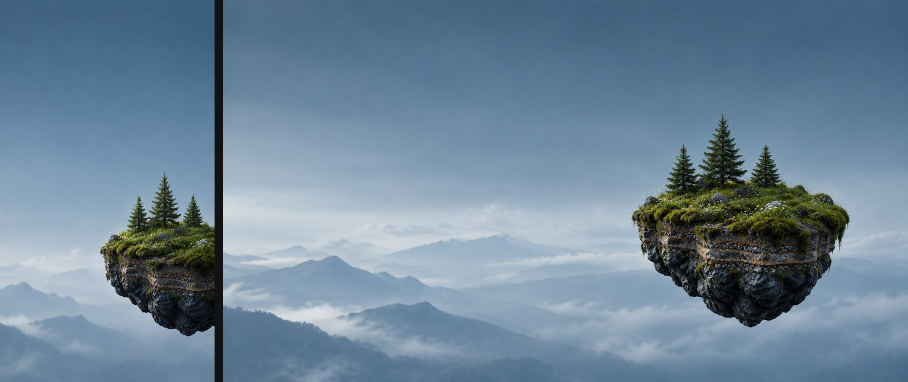
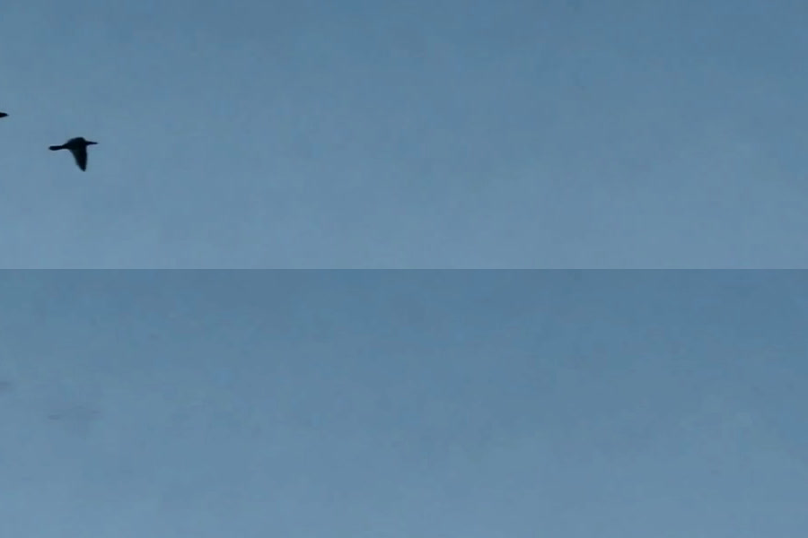
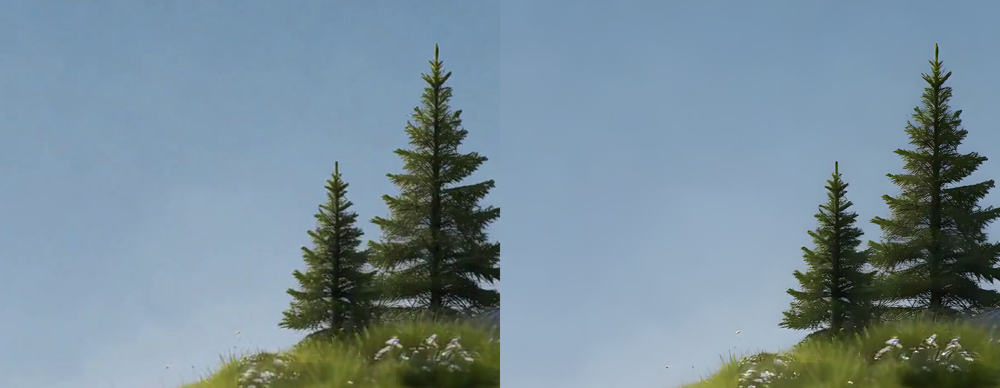
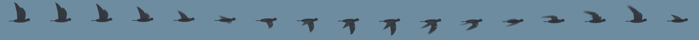

# Hero Scene — How It Was Made

Status: made 2026-09-24/25, approved by the operator as the planner's hero
scene. This is the record of how the looping island behind the phone's
Missions view was made, so it can be rebuilt, changed, or turned into a
product ([Showcase tickets](#what-comes-next)). The look it serves is in
[`spec.md` § 4.2](spec.md#42-mission-controls-hero-scene).

Preview: [`hero-preview.html`](hero-preview.html) (needs the delivery files
beside it; see [Where things live](#where-things-live)). A published copy with
the files is at <https://claude.ai/artifact/WrnGo9ddX2osP1NTZgh9MY>.



## What the operator asked for

Each of these was the operator's call, made while reviewing drafts:

- **The island from "Tall 1"**, the first generated candidate: a floating slice
  of turf over layered soil, pebble strata and dark basalt, with three small
  conifers, moss spilling over the edge, tiny white flowers.
- **No drone.** The business may grow into 3D modelling and reconstruction
  with or without drones, so the hero does not tie it to aircraft.
- **Dreamy and cinematic**, not a scanned object and not a cheap 3D render.
- **The island turns; the camera does not.** A full 360° turn, slow enough to
  read as premium rather than as an advert. In production the turn is at most
  half the generated speed; the operator chose **40 s per turn**.
- **Clouds drift**, and a **barely noticeable breeze** moves the trees, grass
  and flowers.
- **Birds cross the sky**, seen side-on, flapping like real birds. Density was
  doubled after the first review.
- **Slowing the video must not look fuzzy**, and the master is **4K at
  120 fps**, made locally without spending generation credits.
- **The island is always on the right**, in the tall and the wide framing.
- **Both framings turn the same way.** Which way does not matter; that it is
  consistent does. The two clips came back turning in opposite directions; see
  [Spin direction](#spin-direction).

## The pipeline at a glance

```
1  Still         gpt_image_2_5          tall 9:16 and wide 16:9, drone removed
2  Loop clip     minimax_h3             image to video, first frame = last frame, one turn in 10 s
3  Clean sky     debird.py              tall clip only: remove the birds the video model drew
3b Reverse       ffmpeg reverse         tall clip only: so it turns the same way as the wide one
4  Upscale       Real-ESRGAN x4plus     every frame 1440p → 4× → Lanczos down to 4K
5  In-betweens   RIFE v4.6, 16×         243 frames → 3,888, loop closed across the seam: 4K/120 master
6  Cuts          ffmpeg                 1440p/60 AV1 + HEVC, 4K/60 AV1 (wide), 1080p/30 H.264, posters
7  Birds         Blender → sprite       16-frame wingbeat + glide, animated by the page at natural speed
```

Steps 1–2 ran on Higgsfield. Steps 3–7 ran on `akamel-linux` (RTX 4070 SUPER)
and the MacBook, with free tools only. The scripts are in
[`scripts/hero/`](../../scripts/hero/).

## 1. The stills

Model `gpt_image_2_5` on Higgsfield, 0.25 credits an image.

**Tall 1** (job `d3273ba8-9b1b-4588-b719-376fdaddd5dc`, 9:16), one of four
candidates from this prompt:

> Photorealistic 3D render, vertical phone wallpaper. A small floating slice of
> landscape, like a diorama cut out of the earth: a dark wet basalt stone base
> whose cut sides show layered soil and rock strata, its top covered in soft
> green moss, low grass, three small conifer trees and a few tiny white
> wildflowers. A small unbranded matte grey quadcopter drone hovers just above
> it, rotors softly motion-blurred. The floating object sits in the right half
> of the frame, in the lower third, slightly cropped by the right edge.
> Background: calm hazy sky, a smooth gradient from muted steel blue (#496C81)
> at the top to pale misty blue-grey (#AABBCA) near the horizon, faint distant
> mountain silhouettes lost in haze at the lower left. Soft overcast daylight
> with a gentle rim light, shallow depth of field, subtle atmospheric
> perspective, high detail on the stone and moss. The upper-left two thirds of
> the frame is empty sky. No text, no logos, no brand markings, no people.

The sky colours in the prompt are the reference video's sampled sky
([spec § 3.1](spec.md#31-sampled-values)), so the image and the UI tokens
agree.

**Tall, no drone** (job `52fb7ea3-05c0-4b0e-94b6-771f436eaf6d`), Tall 1 as the
reference image:

> Exactly the same image as the reference, with the drone completely removed and
> only sky where it was. Keep everything else identical: the floating island
> with its dark wet basalt base, layered soil and pebble strata, moss spilling
> over the edge, grass, three small conifers, tiny white wildflowers, its
> position in the lower right, the hazy steel-blue sky, the misty mountains and
> low clouds. No text.

**Wide, no drone** (job `921695d3-5967-4665-a3c4-2c68b8357a0b`, 16:9), Tall 1
as the reference image:

> The same scene as the reference image recomposed as a wide landscape frame,
> with no drone. The same floating island (dark wet basalt base, layered soil
> and pebble strata, moss spilling over the edge, grass, three small conifers,
> tiny white wildflowers), fully in frame, placed in the right third of the
> frame and a little below centre. The left two thirds is open hazy steel-blue
> sky over distant misty mountains and low clouds far below. Same soft overcast
> light and photorealistic cinematic look. No text, no drone.

## 2. The loop clips

Model `minimax_h3`, image to video, 10 s, 20 credits a clip. The same still is
passed as both `start_image` and `end_image`, which is what makes the clip
loop without a seam: the island ends exactly where it began.

Each clip comes back as 1440 × 2560 (tall) or 2560 × 1440 (wide), H.264,
24 fps, 243 frames, 10.125 s, with a silent audio track that is dropped.

**Tall** (job `7095257a-ea92-4aa8-acf2-a633be4ee90c`, from the tall still):

> Locked-off camera with no camera movement at all. The floating island slowly
> rotates in place around its own vertical axis, making exactly one full
> 360-degree turn over the whole clip at a constant, gentle speed, and ends
> exactly where it began. As it turns, its other sides come into view: the same
> dark wet basalt base, layered soil and pebble strata, moss spilling over the
> edge, grass and the three small conifers. A barely noticeable breeze gently
> sways the conifers, the grass and the tiny white wildflowers. The low clouds
> far below drift slowly from left to right; the distant mountains stay still.
> A small flock of three or four birds glides slowly across the upper sky from
> left to right and leaves the frame well before the end of the clip. Soft
> overcast daylight, calm, cinematic, photorealistic. No drone, no text, no
> cuts, no zoom, no morphing, no new objects.

**Wide** (job `305d2e1d-8ba3-4690-b1b4-e184dc53687b`, from the wide still): the
same prompt with "It stays in the same place in the right third of the frame."
after the first sentence about the turn, and the bird sentence replaced by "The
sky is empty." and "No birds" added to the exclusions. Birds moved to their
own layer (§ 7) after the first review found the generated ones awkward.

Higgsfield suggested a preset ("IN THE DARK") for the wide prompt; generating
literally needs `declined_preset_id` set to the suggested preset's id.

**Tip for next time:** ask for "the sky is empty" in every clip. The tall clip's
birds had to be painted out (§ 3).

## 3. Clean sky (tall clip only)

The generated birds only cross one band of the tall clip's sky
(y 740–980). [`debird.py`](../../scripts/hero/debird.py) patches that band:

1. A bird is any pixel darker than the brightest value that pixel reaches over
   the whole clip, by more than 7 levels, grown by a few pixels.
2. The clean plate is each pixel averaged over only the frames where no bird
   covers it.
3. Each frame gets the plate shifted to its own mean brightness, so the patch
   does not flicker as the light breathes.
4. The patched band is laid back over the clip with ffmpeg's `overlay`.

Earlier attempts left marks: a per-pixel maximum left a light smudge, a plain
average a dark ghost. The masked average is what worked.



## 4. Upscale to 4K

Slowed down, a 24 fps clip at 1440p looks soft and judders. Resolution first:
[Real-ESRGAN](https://github.com/xinntao/Real-ESRGAN) (`realesrgan-ncnn-vulkan`,
model `realesrgan-x4plus`) enlarges every source frame 4× on the GPU, and
Lanczos brings it back down to 2160 × 3840 (tall) or 3840 × 2160 (wide).
Going up 4× and down again gives sharper needles and pebbles than resizing
straight to 4K, and removes the generator's fine noise in the sky.

Frames are done in batches of 12 so the 5760 × 10240 intermediates never pile
up on the shared disk.



## 5. In-between frames: the 4K/120 master

The fuzziness the operator saw when slowing the video is the browser repeating
frames. The fix is to put real in-between frames in the file.
[RIFE](https://github.com/nihui/rife-ncnn-vulkan) (`rife-ncnn-vulkan`
20221029, model `rife-v4.6`, UHD mode) makes 15 new frames between every pair
of real ones:

- 243 frames × 16 = 3,888 frames, played at 120 fps = **32.4 s per turn**,
  3.2 times slower than the generated clip, with no repeated frames.
- **The loop is closed across the seam**: the first frame is copied after the
  last before interpolating, so the in-betweens also bridge last → first, and
  the extra copy is dropped afterwards. The loop has no hitch.

The master is encoded twice: HEVC (`libx265`, CRF 22, tagged `hvc1` so Apple
players accept it) and AV1 (`libaom-av1`, CRF 34). Both are 4K, 120 fps,
32.4 s, `+faststart`.

[`up4k.sh`](../../scripts/hero/up4k.sh) runs steps 4 and 5 in one go, plus the
first-frame poster and a pre-blurred still for deeper levels. Time on the
4070 SUPER, per clip:

| Stage | Tall | Wide |
|---|---|---|
| Real-ESRGAN, 243 frames | 44 min 43 s | 43 min 32 s |
| RIFE 16×, 3,888 frames | 9 min 32 s | 10 min 23 s |
| HEVC + AV1 encode | 10 min 24 s | 9 min 41 s |
| **Total** | **1 h 04 min** | **1 h 04 min** |

## 6. Delivery cuts

120 fps only helps a 120 Hz screen, and no phone shows 4K, so browsers get
lighter cuts of the master. [`cuts.sh`](../../scripts/hero/cuts.sh) makes them:

| File | Tall | Wide | For |
|---|---|---|---|
| 4K/120 master, HEVC | 31.6 MB | 22.8 MB | Archive; source of every cut |
| 4K/120 master, AV1 | 29.9 MB | 22.9 MB | Archive |
| 4K/60 AV1 | — | 9.9 MB | Wide screens ≥ 2560 device px across |
| 1440p/60 AV1 | 8.1 MB | 6.4 MB | Chrome, Firefox, Apple chips with AV1 decode |
| 1440p/60 HEVC | 9.5 MB | 7.0 MB | Safari on everything else |
| 1080p/30 H.264 | 7.8 MB | 6.2 MB | Last resort |
| Poster, 1440p JPEG | 187 KB | 181 KB | Under the video; reduced motion; Low Power Mode |
| Blurred still | 41 KB | 46 KB | Deeper levels (Settings, sheets) |

A 120 fps cut for 120 Hz desktops is possible from the same master; it was not
made because 60 fps already looked smooth to the operator.

## 7. The birds

Birds are a layer of their own, drawn by the page over the video, so they fly at
natural speed whatever the island's playback speed is, and can be switched off.

**The bird** — [`bird.py`](../../scripts/hero/bird.py) builds a gull-like bird
in Blender 5.2 from primitives (body, head, tail, two-part wings) and renders
one wingbeat as 16 frames plus a glide pose:

- Downstroke is 55 % of the beat, wings sweeping from +48° to −34° with the hand
  fully spread.
- On the upstroke the hand folds back at the wrist (up to 58°) and droops, the
  way a real bird reduces drag.
- The body rises slightly on each downstroke.
- Seen side-on, slightly below and ahead, with motion blur (shutter 0.45),
  Cycles, 192 px cells.

A first version seen from below read as a flat cross; the side-on camera is
what made it a bird. [`sprite.py`](../../scripts/hero/sprite.py) packs the 17
frames into one 1224 × 72 WebP strip (15 KB).



**The flock** — the page spawns a flock every 9–20 s (18–40 s before the
operator doubled the density):

| Parameter | Value |
|---|---|
| Birds per flock | 2–4, the leader largest |
| Direction | 60 % left to right; right to left is the sprite mirrored |
| Height | 10–30 % of the screen from the top, drifting slightly up or down |
| Speed | 70–100 px/s, each bird within ±3 % of the flock |
| Size | 16–28 px, followers 75–100 % of the leader |
| Wingbeat | 0.30–0.34 s; 3–6 beats, then a 0.6–1.6 s glide, repeated |
| Motion | ±3° bank and a 4 px bob, out of phase between birds |
| Opacity | 0.55 + size / 60, so smaller birds read as farther away |

No birds with `prefers-reduced-motion`, and none while the page is hidden.

## Playback in the page

These rules are what the preview does and what production must keep:

- **Choose one file.** Tall when the viewport is taller than wide, else wide.
  Sources in order: AV1 (`av01.0.13M.08` for 4K/60, `av01.0.12M.08` for 1440p),
  HEVC (`hvc1`), H.264. 4K/60 only when `innerWidth × devicePixelRatio ≥ 2560`.
- **40 s per turn** in both framings: `playbackRate = 0.8` on the 32.4 s
  file. Set it again on `loadeddata`: loading a new source resets it. There is
  no speed setting in the product.
- `muted playsinline autoplay loop`, poster underneath.
- **Pause** when the page is hidden, under a sheet and off the Missions view.
  `prefers-reduced-motion` shows the poster only.
- **Low Power Mode** (iOS, macOS) refuses autoplay; the poster shows, and the
  first touch or key press starts it.
- **Safari needs HTTP range requests.** The file server must answer
  `Range:` with `206 Partial Content`. Vercel's static files do. Safari did not
  play the video from the artifact host while Chrome did, although WebKit plays
  the same files from a plain local server; the preview works around the host
  by downloading the file whole and playing it from memory. Production must be
  checked on Safari (macOS and iPhone), and no service worker may sit in front
  of the video without range support.

### Spin direction

The generated clips turn opposite ways. Measured by block-matching frames,
the near side of the island moves **right to left in the tall clip** and **left
to right in the wide clip**. A narrow window (a phone, Claude's side pane)
plays the tall one, so the two looked inconsistent. The prompt does not
control the direction; check it on every new clip.

Mirroring a clip reverses its turn but also moves its island to the other side
of the frame, so the tall clip is **played backwards** instead, before
upscaling. A turn reversed in time is still a turn; the clouds then drift the
other way, which nobody can tell. Both files now turn with the near side
moving left to right.

```bash
ffmpeg -i tall-nobirds.mp4 -vf reverse -an -c:v ffv1 tall-nobirds-rev.mkv   # lossless, 243 frames
```

The earlier, unreversed tall files are kept as `hero-tall-rtl-*` until the
reversed ones are approved.

### Placement

The island is always on the right. Both clips put it in the right third or
right edge of the frame, and the page anchors the crop to the right edge:

```css
.scene video, .scene img { object-fit: cover; object-position: 100% 60%; }
```

At 100 % nothing is ever cropped off the right, so the whole island stays in
view on any landscape window, and on a phone it keeps the tall clip's
right-edge composition.

## Where things live

| What | Where |
|---|---|
| Scripts | [`scripts/hero/`](../../scripts/hero/) |
| Masters, cuts, posters | `akamel-linux:~/hero3d/web4k/` (143 MB) — not yet backed up anywhere else |
| Generated clips | `akamel-linux:~/hero3d/src/` (`tall-nobirds.mp4`, its reversal `tall-nobirds-rev.mkv`, `wide-raw.mp4`), and in the Higgsfield account under the job ids above |
| Tools | `akamel-linux:~/hero3d/tools/` (659 MB) |
| Blender | `akamel-linux:~/blender-5.2.2-linux-x64/` |
| Blender island experiment | `akamel-linux:~/hero3d/` (`hero.py`, `out/v1`–`v5`, `assets/`) |

| Tool | Version | Licence | Use |
|---|---|---|---|
| Real-ESRGAN ncnn Vulkan | 20220424 (v0.2.5.0), `realesrgan-x4plus` | BSD-3-Clause | Upscale |
| rife-ncnn-vulkan | 20221029, `rife-v4.6` | MIT | In-betweens |
| ffmpeg | 7.0.2 static (johnvansickle.com) | GPL-3.0 | Encode; a tool, never shipped |
| Blender | 5.2.2 | GPL | Bird sprite, island experiment; renders are ours |
| Poly Haven assets | 2k | CC0 | Island experiment only |

**Open item:** the stills and clips were generated on a Higgsfield free trial.
Confirm that plan's terms allow commercial use of its outputs before the hero
ships in the product or in marketing.

## Rebuilding it

On `akamel-linux`, with the tools in `~/hero3d/tools`:

```bash
# 3. clean sky (tall only), on any machine with ffmpeg and Pillow — see debird.py's docstring
# 3b. play the tall clip backwards so it turns the same way as the wide one
ffmpeg -i ~/hero3d/src/tall-nobirds.mp4 -vf reverse -an -c:v ffv1 ~/hero3d/src/tall-nobirds-rev.mkv
# 4–5. upscale and interpolate: about an hour per clip on the 4070 SUPER
bash up4k.sh ~/hero3d/src/tall-nobirds-rev.mkv hero-tall 2160 3840
bash up4k.sh ~/hero3d/src/wide-raw.mp4 hero-wide 3840 2160
# 6. delivery cuts: seconds for H.264, minutes for AV1
bash cuts.sh hero-tall 1440 2560
bash cuts.sh hero-wide 2560 1440
# 7. bird sprite
blender -b --factory-startup -P bird.py -- ~/hero3d/out/bird
python3 sprite.py ~/hero3d/out/bird bird-sprite.webp
```

## Tried and dropped

| Approach | Why it was dropped |
|---|---|
| A camera orbit, as in the reference video | The operator wanted the camera still and the island turning |
| Image-to-3D models (Hunyuan3D and others) shown live with three.js | Read as scanned objects; trees especially poor |
| The island built procedurally in Blender (passes v1–v5, `hero.py`, `grade.py`) | Promising, but needed 5–10 more passes to reach the generated look. Kept for the Showcase work |
| ffmpeg `minterpolate` for slow motion, on the MacBook | Far too slow on the CPU; RIFE on the 4070 replaced it |
| Mirroring one clip so both turn the same way | Mirroring the tall clip moved its island to the left |
| RIFE 4× at 30 fps | Superseded by 16× at 120 fps |
| Birds drawn by the video model | Stiff, unnatural flapping, and tied to the island's playback speed |
| Birds rendered from below | Read as a flat cross, not a bird |

## What comes next

The same look, applied to a real Site: a customer's Reconstruction cut out as
a floating island, turning in a graded sky. That is a cinematic deliverable in
the sense of [ADR 0009](../adr/0009-correction-on-input-grading-on-output.md)
and the `render` and `grade` Nodes in [`design.md`](../design.md). Its tickets
are proposed separately; `hero.py`, `grade.py`, `up4k.sh` and `cuts.sh` are
where it starts.
