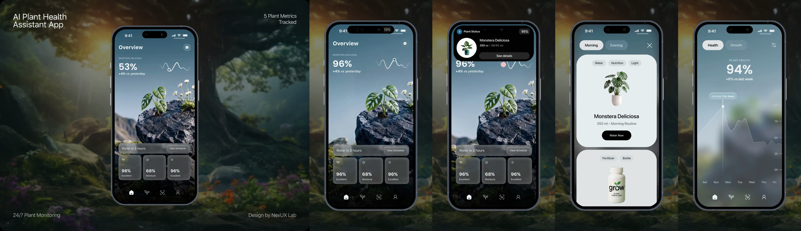

# UI Theme — Visual Specification

Status: draft 2026-09-24, extracted from the reference video. § 4.2 settled
2026-09-25 with the finished hero scene. Input to the redesign plan; nothing
here is built into the planner yet.

This document records what the reference video shows — colours, materials,
type, shapes, components and motion — measured from its frames, and states how
each translates to Mission Control in a desktop browser and on a touch screen.
It describes the look. Which screens change, in what order, is the plan's job.



## 1. The reference

`fdaf3f990a117327b4793a107ca2d836.mp4` — 8.2 s, 2400×1800, 60 fps. A
presentation reel of a mobile "plant health" app: one phone mock-up on a
painted forest backdrop, stepping through four screens. Measurements below
convert the phone's screen pixels to CSS px at 1.58 device px per CSS px (an
iPhone 393 px wide), so every size here is a CSS px value.

| Time | What happens |
|---|---|
| 0.0–0.5 s | Overview screen at rest. Top pill (Live Activity) widens from the camera notch. |
| 0.3–1.0 s | Live Activity title "Plant Status" wipes in left to right; its value counts 88 → 96 %. |
| 0.87–1.40 s | Live Activity grows downward into a black panel; avatar pops, then name, meta and "See details" fade in. |
| 2.3–2.7 s | Tap on "See details" (the pink dot is the reel's touch marker). |
| 2.75–3.10 s | Overview blurs and dims; the Live Activity morphs into a frosted panel that becomes the sheet backdrop. |
| 3.10–3.55 s | Sheet content materialises: pills, close button, then two light panels, staggered. |
| 4.55–4.70 s | Tap on the close button. |
| 4.85–5.10 s | Sheet panels dissolve into blur. |
| 5.10–6.20 s | Health screen: chrome fades in, figure counts 0 → 94 %, chart line draws, tooltip appears. |
| 6.90–7.40 s | Screen push: Health exits left, Overview enters from the right while the backdrop crossfades. |
| 7.00–7.90 s | Overview figure counts 0 → 96 % while its sparkline draws. |

## 2. The language in six rules

1. **A photograph is the surface.** Every screen sits on one full-bleed image.
   The UI floats on it; it never sits on a flat fill.
2. **Depth is blur.** The same photograph appears sharp at the top level and
   blurred behind anything deeper (a sheet, a detail view). Going deeper blurs
   more; coming back sharpens.
3. **Two materials, never mixed on one element.** Dark smoke glass for
   information on the photograph; opaque off-white light panels for the one object
   in focus. Black is reserved for the notice and for primary buttons on
   light panels.
4. **One number leads.** Each screen has a single very large figure with a
   delta line beneath it. Everything else is small.
5. **Colour comes from the image, not the UI.** The UI itself is white,
   greys, black and translucent white. The only saturated hues are in the
   photograph (moss, leaf, sun) and a single steel-blue icon badge.
6. **Things arrive by counting, drawing and sharpening** — never by bouncing
   or sliding in from far away. Motion is short, decelerating, and without
   overshoot.

## 3. Colour

### 3.1 Sampled values

All sampled from frames; glass values are the rendered result over the photo,
not the fill that produced them.

| Where | Sampled |
|---|---|
| Sky, top of screen | `#496C81` |
| Sky, middle | `#7C99AD` |
| Sky, horizon haze | `#AABBCA` |
| Sky behind a sheet (blurred, dimmed) | `#426370` |
| Health screen, top / middle (blurred) | `#6B8B99` / `#829EAD` |
| Health screen, lower blurred scene | `#444A53` / `#575F56` |
| Stone in the hero photo | `#474B59` |
| Leaf | `#517046` |
| Smoke glass tile, rendered | `#3E4142`–`#43494B` |
| Banner glass, rendered | `#41474B` |
| Button inside banner, rendered | `#6A6D70` |
| Tab bar scrim (bottom of screen) | `#0A0908` |
| Live Activity body | `#020202` |
| Live Activity button | `#262626` |
| Live Activity icon badge | `#1C618A` |
| Pill, active (on sheet) | `#DEE0E4` |
| Pill, inactive (on sheet) | `#5A7B8B` (white ≈ 15 % over the sky) |
| Pill, inactive (on Health) | `#7793A2` (white ≈ 8–10 %) |
| Tooltip pill | `#9AB9C6` (white ≈ 25 %) |
| Light panel | `#E7EDEF` |
| Light panel, second | `#E0E2E4` |
| Chip on light panel | `#D6DBDE` |
| Ink on light panel | `#000000` title, `#666C6C` secondary, `#272D2F` chip text |
| Primary button on light panel | `#000000` |
| Backdrop forest, darkest to lightest | `#0A0E0F` `#101819` `#161C1B` `#21211C` `#27312D` `#525852` |
| Backdrop haze | `#788B92` |
| Backdrop sun glow | `#5B4726` → `#7D784F` → `#C5C8BD` at the core |

### 3.2 Proposed tokens

Names are proposals; the plan fixes them. The operational status colours stay:
a Mission that cannot dispatch must still read as a warning, whatever the
theme.

| Token | Value | Use |
|---|---|---|
| `--sky-top` | `#496C81` | Top of the screen gradient when no photo loads |
| `--sky-mid` | `#7C99AD` | |
| `--sky-low` | `#AABBCA` | |
| `--canopy-900` | `#0A0E0F` | Deepest background, page behind everything |
| `--canopy-700` | `#161C1B` | |
| `--canopy-500` | `#27312D` | |
| `--haze` | `#788B92` | Muted, atmospheric neutral |
| `--glass-smoke` | `rgb(40 44 46 / 0.68)` + blur, `0.75` at 1000 px and wider (reference: 0.55) | Tiles, banners, panels on the photograph |
| `--glass-clear` | `rgb(255 255 255 / 0.14)` + blur | Inactive pills, icon buttons, on sky |
| `--glass-clear-strong` | `rgb(255 255 255 / 0.22)` | Buttons inside glass, tooltip |
| `--glass-edge` | `rgb(255 255 255 / 0.14)` | 1 px inner highlight on every glass shape |
| `--scrim-bottom` | `linear-gradient(transparent, #0A0908)` | Under the tab bar |
| `--panel-light` | `#E7EDEF` | Light panel |
| `--panel-light-alt` | `#E0E2E4` | Second light panel in a stack |
| `--chip` | `#D6DBDE` | Chip on a light panel |
| `--pill-active` | `#DEE0E4` | Selected pill |
| `--ink` | `#0B0B0C` | Text on light surfaces |
| `--ink-2` | `#666C6C` | Secondary text on light surfaces |
| `--on-glass` | `#FFFFFF` | Text on glass and photo |
| `--on-glass-2` | `rgb(255 255 255 / 0.85)` | Labels ("Excellent") |
| `--on-glass-3` | `rgb(255 255 255 / 0.80)` (reference: 0.60) | Overlines, day names |
| `--on-glass-4` | `rgb(255 255 255 / 0.80)` (reference: 0.45) | Axis numbers |
| `--black` | `#000000` | Notice, primary button on a light panel |
| `--badge-blue` | `#1C618A` | The one UI hue in the reference (icon badge) |
| `--warn` | `#E0A94F` (kept) | Operational warnings |
| `--danger` | `#E0704F` (kept) | Errors, refusals |

**Accent.** The reference has no accent colour of its own. The current app's
teal (`#4FB8A8`) marks active state and success. Options for the plan: keep
the teal; move to the leaf green (`#517046`, too dark as-is on dark glass —
it needs lifting to about `#7FB069`); or drop a hue accent entirely and mark
active state the reference's way, with a white pill and dark ink. The third
matches the reference most closely.

## 4. Background and imagery

### 4.1 In the reference

- **A full-bleed 3D scene** behind the top-level screen: a sky-and-stone scene
  with the subject (the plant) in the right half, lower third, leaving the
  top-left for the title and the lead figure.
- **It moves.** The camera orbits slowly around the subject: the plant and the
  top of the stone drift left about 13 px a second while the flowers at the
  frame's edge drift about a third as fast. That difference in speed is the
  parallax that makes it read as a place rather than a picture.
- **A bottom scrim** darkens the lowest ~20 % of the screen to near-black so
  the tab bar reads.
- **Blurred continuity.** Deeper screens show the same scene blurred about
  30–40 px and slightly desaturated, with brightness pulled down ~30 % under a
  sheet. The scene never changes between levels; only its blur does.
- **The reel's own backdrop** (a painted forest at dawn, deep greens, a warm
  sun glow top-left, vignetted corners) is the reel's frame, not the app.

### 4.2 Mission Control's hero scene

Settled 2026-09-25 with the finished scene. How it was made, and how to
rebuild it: [`hero-pipeline.md`](hero-pipeline.md). Prototype:
[`hero-preview.html`](hero-preview.html).

**Subject.** A floating island: a slice of turf cut out of the earth like a
diorama, moss spilling over its edge, three small conifers and tiny white
flowers on top, layered soil and pebble strata and dark basalt below. It is
what the business makes, a 3D model of a place, without tying it to aircraft:
there is no drone. It takes the reference's composition: the island **always
on the right** (the right third of the wide framing, the right edge of the
tall one), in the lower half; hazy sky from `--sky-top` to `--sky-low`; the
top-left clear for the title and lead figure.

**Motion.** The camera never moves. The island turns on its own vertical axis,
**one full turn every 40 s**, the same direction in every framing. The clouds
far below drift slowly, and a barely noticeable breeze moves the trees, grass
and flowers. Every 9–20 s a small flock of two to four birds crosses the upper
sky, seen side-on, flapping in bursts and gliding, at natural speed.

**Delivery: a pre-rendered loop, not a live engine.** The island is rendered
once and shipped as video. The phone plays it with its hardware video decoder,
which costs far less power than drawing 3D every frame, and MapLibre stays the
only 3D engine on the page. The birds are a separate sprite layer drawn by the
page, so they keep natural speed whatever the video does.

- **Loop**: the first frame is the last, so it loops forward without a seam.
  The master is 4K at 120 fps, 32.4 s per turn; the page plays it at 0.8×,
  which is 40 s. There is no speed setting.
- **Files**, for each of a tall and a wide framing: 1440p/60 AV1 and HEVC,
  1080p/30 H.264, a poster of the first frame and a pre-blurred still; the
  wide framing also has 4K/60 AV1 for screens at least 2560 device pixels
  across. 6–10 MB a cut. Served under content-hashed names with long-lived
  cache headers, so each device downloads its cut once, and by a server that
  answers range requests (Safari will not play video without them).
- **Playback**: `muted playsinline autoplay loop`, poster underneath. It plays
  only while its view is on screen and the page is visible. It pauses under a
  sheet (the blur hides it anyway), on the map, and when the page is hidden.
- **Deeper levels** (the Settings view, sheets) show the pre-blurred still, not
  a live blur of the video, so nothing re-blurs on every frame.
- **Low power**: iOS and macOS refuse to autoplay video in Low Power Mode; the
  poster then shows, and the first touch starts it. `prefers-reduced-motion`
  shows the poster and no birds.

**Placement.**

| Where | Shows |
|---|---|
| Phone, Missions view (home) | The hero scene, playing |
| Phone, Settings view | The pre-blurred still |
| Phone, Map view | The map |
| Any sheet | Whatever is behind it, blurred and dimmed |
| Wide screen | The map, full-bleed, with glass panels over it |
| Wide screen, map cannot load (no network) | The hero scene. With no Missions yet the map still shows: it is where the first one is drawn |

**The map is the other photograph.** Wherever the operator is working on the
area, the satellite basemap is the surface and the panels are glass over it.

## 5. Materials

**Smoke glass** — tiles, banner, floating panels on the photograph.

```css
background: rgb(40 44 46 / 0.55);
backdrop-filter: blur(20px) saturate(120%);
box-shadow: inset 0 1px 0 rgb(255 255 255 / 0.14),
            inset 0 0 0 1px rgb(255 255 255 / 0.06);
```

Lighter at the top edge than the bottom: add
`linear-gradient(180deg, rgb(255 255 255 / 0.06), transparent 60%)` over the
fill. Content behind it is unreadable through it (blur strong enough that the
stone's texture disappears).

**Clear glass** — inactive pills, icon buttons, the tooltip; used where the
backdrop is bright sky. White fill at 8–25 % with the same blur and a
1 px `rgb(255 255 255 / 0.3–0.45)` edge on the tooltip.

**Light panel** — opaque `--panel-light`, no blur, no border, no visible
shadow; it separates from the blurred backdrop by value alone. A second panel
in a stack is a shade greyer (`--panel-light-alt`).

**Notice black** — pure black, no transparency, sitting where the
camera notch is. It is the only element that is "hardware-coloured".

**Frosted transition state** — during a transition the leaving element passes
through a frosted state (white 20–40 %, heavy blur) before it disappears. See
§ 9.

## 6. Typography

The reference uses two faces: a wide geometric grotesque for the screen title
and lead figures, and the system UI face (SF Pro) for everything else. A free
display face close to the reference is Manrope 700; the text face stays the
system stack. Figures that count must use tabular numerals so the width does
not jitter.

| Role | Size / line | Weight | Tracking | Colour | Example |
|---|---|---|---|---|---|
| Lead figure, detail | 60 / 1.0 | 700 | −0.02 em | `--on-glass` | "94%" |
| Lead figure, overview | 42 / 1.05 | 700 | −0.01 em | `--on-glass` | "96%" |
| Screen title | 34 / 1.1 | 700 | 0 | `--on-glass` | "Overview" |
| Panel title | 26 / 1.2 | 500 | −0.01 em | `--ink` | "Monstera Deliciosa" |
| Tile figure | 22 / 1.1 | 700 | 0 | `--on-glass` | "68%" |
| Delta line | 17 / 1.3 | 600 | 0 | `--on-glass` at 90 % | "+4% vs yesterday" |
| Banner text, pill label | 17 / 1.3 | 400–500 | 0 | `--on-glass` / `--ink` | "Water in 2 hours" |
| Panel secondary | 16 / 1.35 | 400 | 0 | `--ink-2` | "350 ml • Morning Routine" |
| Button | 15 / 1.2 | 500 | 0 | white on black / white on glass | "Water Now" |
| Label | 13 / 1.3 | 400 | 0 | `--on-glass-2` | "Excellent", chips, tooltip |
| Overline | 12–13 / 1.3 | 500 | +0.06 to +0.08 em, caps | `--on-glass-3` | "PLANT HEALTH" |
| Axis | 13 / 1 | 400, tabular | 0 | `--on-glass-4` | "75", "Wed" |

Mission Control's monospace readouts (coordinates, IDs) keep `--mono`; they
are data, not display.

## 7. Shape, spacing and layout

- **Radii** are concentric: an element inside another has the outer radius
  minus the inset. Measured: button in banner 12, banner 18, tile 20,
  pill fully round (23 on a 46 px pill), light panel 36, notice 44.
- **Screen margin** 20 on the main screen; sheets use a tighter 10 so their
  panels read as a layer above.
- **Gaps**: tiles 8, stacked panels 12, tile padding 16, chip gap 8.
- **Grid**: three equal tiles across (111 × 122 each at 393 wide), a
  full-width banner above them, both anchored to the bottom above the tab bar.
- **Vertical rhythm of the overview**: title top-left, the lead figure below
  it with its sparkline to the right, photograph subject in the middle,
  banner + tiles + tab bar stacked at the bottom. The middle of the screen is
  left to the photograph.
- **Sizes of touch elements** in the reference: pills 46 tall, primary button
  45, icon button 36, tab icons 24 on a ~76 px pitch, chips 28 tall.

## 8. Components

**Lead figure with delta** — overline naming the subject, figure, delta line.
Counts up on arrival (§ 9). On the overview a sparkline sits to its right.

**Sparkline** — 2 px white line, no axis, fading to transparent at both ends;
a 12 px ring marker (2 px white stroke, translucent centre) on the latest or
most notable point.

**Status banner with inline action** — smoke glass, 50 tall, radius 18. Text
left; a clear-glass button right, inset 7 on all sides so its radius is 12.

**Metric tile** — smoke glass, radius 20, padding 16. Line icon top-left
(18 px, 1.5 px stroke); figure and label bottom-left. Three across.

**Segmented pills** — 46 tall, fully round. Active: `--pill-active` fill,
`--ink` text. Inactive: clear glass, white 55–60 % text. Two options in the
reference; the switcher sits top-left with the close or filter control
top-right.

**Map controls** — decided 2026-09-26 (plan decision 19), icons revised the
same day (plan decision 20). Two buttons where the pills were, never one row
mixing the two kinds of control. **Base map** (layers glyph + current base
map's icon) opens a menu of base maps, one selectable at a time
(`menuitemradio`); choosing applies it and closes the menu. Each menu item
shows its base map's icon instead of its name — a satellite glyph for
imagery, a folded street map with road lines for OpenStreetMap, both in the
tab bar's line style (24 px grid, 1.5 px stroke, round caps and joins).
**Overlays** (overlays glyph + "Overlays", with "· N" when any are on) opens
a menu of independent switches, Numbers and Footprint (`menuitemcheckbox`);
toggling keeps the menu open. Below 1000 px both buttons are icons only: the
Base map button shows the current base map's icon, the Overlays button its
glyph with the count as a small badge. The icons are the visible label; the
accessible names carry the wording for screen readers (`Base map:
Satellite`, `Overlays, 2 on`, `Satellite imagery`, `Street map
(OpenStreetMap)`), and nothing lives in a tooltip or title only. Only one menu open at a
time; tap-outside, Escape, or opening the other menu closes it with focus back
on its button; `aria-haspopup="menu"` with `aria-expanded`; arrow keys move
within a menu; every item at least 44 px tall; one code path for touch and
mouse. Buttons and menu share option A material (40 % white fill, dark ink,
blur 20 px — the fill opacity carries the 4.5:1 contrast on any basemap, per
the reasoning in `MapPane.module.css`); menu radius 18, item radius 12;
selected base map and on-overlays show the active formula (`--pill-active`,
`--ink`, weight 600) with a check glyph. Motion: press scales to 0.97 under a
6 % white overlay over `--dur-press` from pointer-down (§ 11); opening morphs
out of its button, width and height together, 500 ms `--ease-emphasised`, no
overshoot, items staggered by `--stagger` fading from 4 px blur to sharp over
150 ms (§ 9.1); closing dissolves, opacity + blur, 250 ms `--ease-in`, no
movement. Only `transform`, `opacity`, `filter`, `clip-path` animate (§ 9.3);
under `prefers-reduced-motion` a 150 ms crossfade, no scaling.

**Chips** — 28 tall, fully round, `--chip` on a light panel, 13 px `#272D2F`
text, centred in a row above the panel's object.

**Icon button** — 36 square, radius 12, clear glass, 18 px glyph. The close
control is a bare 24 px thin X without a container.

**Primary button** — on a light panel: black pill, white 15/500 text, 45 tall,
hugging its label with ~32 px side padding. On the notice:
`#262626` pill spanning the content column. On glass: clear-glass pill.

**Light panel** — radius 36, padding 24 top. Chips, a centred object
image, title, secondary line, primary button, in one centred column. Panels
stack with a 12 gap; the next panel peeks from the bottom of the screen,
signalling scroll.

**Notice** (the reference's Live Activity) — black shape at the notch. Compact: pill with an icon
badge (blue circle, white glyph), a title, and a value in a dark capsule on
the right. Expanded (≈ 355 × 163): the same header row, a 99 px white circle
holding the subject image, name (17/500 white), meta ("350 ml | 08:00 AM" —
value white, separator and unit grey), and a full-width "See details"
button. Tapping it opens the detail sheet by morphing into it.

**Sheet** — full-screen, over the blurred and dimmed parent. Pills top-left,
close top-right, light panels below. Leaves by dissolving into blur.

**Chart with scrubber** — area-less line (1.5 px white at 75 %), y-axis on the
right (numbers with 10 px tick lines), day names along the bottom, both in
`--on-glass-4` / `--on-glass-3`. The selected point has a vertical 1 px white
guide from the baseline to a tooltip pill (clear glass, 13 px) and a ring
marker at the line. The chart floats directly on the blurred photo — no panel.

**Tab bar** — four line icons (24 px, 1.5 px stroke, rounded caps), evenly
spaced, no labels, over the bottom scrim. Active: filled glyph, white.
Inactive: outlined, white 85 %.

**Editorial corner labels** (from the reel's frame) — small white sans text in
the four corners of a full-bleed image: product name top-left (two lines,
17 px), a fact top-right (11 px, right-aligned), taglines bottom-left and
bottom-right. A usable pattern for the wide screen's no-network state.

## 9. Motion

Every transition in the reference decelerates to rest with no overshoot, and
exits are faster than entrances.

### 9.1 Measured

| Motion | Measured | Proposed spec |
|---|---|---|
| Live Activity widens (compact) | 367 → 409 px device width in ~200 ms, ease-out | 200 ms, `--ease-out` |
| Title wipe inside it | letters revealed left→right over ~600 ms while the pill widens | clip-path/mask reveal, 500 ms, `--ease-out` |
| Live Activity expands (height 61 → 257 device px) | 33 % at 100 ms, 57 % at 150 ms, 76 % at 250 ms, 91 % at 400 ms, rest by ~500 ms; no overshoot | 500 ms, `--ease-emphasised`; width and height together |
| Expanded content | avatar scales in at +100 ms; text and button fade from blurred to sharp at +300 ms, ~150 ms each | stagger 100 ms, 150 ms fade + 4 px → 0 blur |
| Sheet opens | parent blurs and dims ~30 % over 350 ms (2.75–3.10 s) | 350 ms, `--ease-out`, blur 0 → 32 px, brightness 1 → 0.7 |
| Sheet content | pills, then close, then panel 1 (from ~0.92 scale, frosted, 50 % opacity to solid), then panel 2 rising ~40 px; 3.10–3.55 s | 400 ms each, stagger 80–100 ms, `--ease-out` |
| Sheet dismisses | content dissolves to blur over 250 ms (4.85–5.10 s) | 250 ms, `--ease-in`; opacity + blur, no movement |
| Next screen chrome | fades in over ~150 ms after the dissolve | 150 ms, `--ease-out` |
| Figure counts up (Health) | 5, 20, 34, 49, 63, 78, 91, 94 at 125 ms steps: near-linear, soft landing, ~900 ms | 900 ms, `--ease-count` |
| Figure counts up (Overview) | 0 → 96 at ~11 per 100 ms, ~900 ms | same token |
| Chart and sparkline draw | stroke draws left→right in sync with the count; marker rides the leading end; guide line grows up; tooltip fades in at ~80 % | stroke-dashoffset, 700–900 ms, same curve; tooltip 150 ms at the end |
| Screen push | outgoing slides left, incoming from the right, backdrop crossfades behind, ~400 ms | 400 ms, `--ease-emphasised`; backdrop at 0.3× the distance |

The pink dots in the reel mark where the recording tapped; they are not part
of the design. The whip-cuts between phone positions in the last second are
the reel's editing.

### 9.2 Tokens

| Token | Value |
|---|---|
| `--dur-press` | 120 ms |
| `--dur-fast` | 150–200 ms |
| `--dur-base` | 250–350 ms |
| `--dur-slow` | 400–500 ms |
| `--dur-count` | 900 ms |
| `--ease-out` | `cubic-bezier(0.22, 1, 0.36, 1)` |
| `--ease-emphasised` | `cubic-bezier(0.3, 0.7, 0.2, 1)` (fits the measured Live Activity curve) |
| `--ease-in` | `cubic-bezier(0.4, 0, 1, 1)` (exits only) |
| `--ease-count` | `cubic-bezier(0.3, 0.1, 0.3, 1)` |
| `--stagger` | 80–100 ms |

### 9.3 Rules

- Animate `transform`, `opacity`, `filter` and `clip-path` only.
- Blur is a transition device, not a resting decoration that animates:
  animate the blur of one layer, never of many at once.
- Count-ups run once when a figure first appears, and again only when its
  value changes — never on every render or re-poll.
- Nothing loops except the hero scene (§ 4): the island's turn and its
  birds. No idle shimmer, no breathing gradients.

## 10. Web browser (pointer, wide screen)

- **Layout pattern**: the map full-bleed as the photograph; the Mission list,
  the settings and the summary become floating smoke-glass panels inset
  12–16 px from the viewport edges, radius 20, rather than columns separated
  by borders. The canopy backdrop fills anything outside the app.
- **Hover**: glass brightens by about 4 % white (`--glass-edge` up to 0.22),
  120 ms. Light panels darken 2 %. No hover-only information.
- **Focus**: 2 px white ring at 2 px offset, plus a 4 px dark halo
  (`rgb(0 0 0 / 0.35)`) so the ring shows on bright sky and dark glass alike.
- **Keyboard**: Escape closes a sheet or an expanded notice; focus
  returns to what opened it. Pills are a radio group (arrow keys move).
- **Scrollbars**: thin, overlay, `rgb(255 255 255 / 0.25)` thumb on glass.
- **Sheets on wide screens**: a centred panel (max ~560 px) or a side sheet
  over the blurred map — not a full-screen takeover.

## 11. Touch screens (phone and tablet)

- **Targets** at least 44 × 44. Chips (28) and tab icons (24) keep their
  visual size and get padded hit areas.
- **Press**: scale 0.97 plus a 6 % white overlay over `--dur-press`; spring
  back on release. Press shows on touch-down, not after the tap completes.
- **Tab bar**: the existing narrow-screen switcher (Missions / Map / Settings)
  becomes the reference's tab bar over a bottom scrim. The reference has no
  labels; for an operator tool used at arm's length, keep a 11 px label under
  each icon.
- **Sheets**: rise from the bottom over the blurred parent; drag down or tap
  the close control to dismiss; a 36 × 5 px grab handle at the top.
- **Sheet drag**: drag down on the grab handle to dismiss; a fast downward
  flick — at least 0.5 px/ms measured over the pointer's last 100 ms, with at
  least 16 px of travel — dismisses without the full 120 px; upward movement
  resists towards a 64 px limit and settles back; a released drag returns to
  rest over `--dur-base` / `--ease-out`, with no overshoot. The constants live
  in `web/lib/sheet.ts` (#256).
- **Swipe between views** mirrors the reel's screen push, but only where it
  cannot fight the map: never on the map view, where a horizontal drag pans.
- **Safe areas**: `env(safe-area-inset-*)` on the tab bar, the notice
  and sheet edges.
- **The notice** sits top-centre below the safe-area inset; on devices
  without a notch it is simply a floating black pill.
- **Haptics**: the web has no iOS haptics; `navigator.vibrate` exists only on
  Android. Not part of the spec.

## 12. Accessibility and fallbacks

**Built differently from the reference (operator, 2026-09-29, #188, Option A):** the reference's glass (smoke 0.55, dim text 0.60 and 0.45) cannot hold 4.5:1 over snow-bright satellite tiles or the brightest hero mist; 190 of 416 measured text runs fell short. The planner raises smoke glass to 0.68 (0.75 over the map at 1000 px and wider), both dim text tokens to 0.80, and puts a soft dark gradient behind the home page title and buttons. That leaves 4 short runs, small labels sitting straight on the sky.

- **Sunlight.** The operator reads this on a phone at the aircraft, outdoors.
  Glass over bright satellite imagery is the weakest point of this theme. Text
  on glass must hold 4.5:1 against the lightest backdrop it can sit on; raise
  the glass fill opacity until it does, rather than shrinking the text or
  adding shadows.
- **`prefers-reduced-transparency`** (and browsers without `backdrop-filter`):
  glass becomes opaque — smoke glass `#2B3033`, clear glass `#5A7B8B`.
- **`prefers-contrast: more`**: opaque surfaces, `--on-glass-3/4` raised to
  0.85, 1 px white borders on glass.
- **`prefers-reduced-motion`**: figures show their final value; lines appear
  drawn; blurs and pushes become 150 ms crossfades; no parallax; the hero
  scene shows its poster, without birds.
- **Performance.** The map is a WebGL canvas that repaints on every pan and
  zoom frame, and every glass panel over it re-blurs each of those frames. On
  phones this is the likeliest cause of a sluggish map. Keep the number of
  blurred layers over the map small, and be prepared to swap blur for an
  opaque fill while the map is moving or on touch devices. Measure before
  deciding.

## 13. Not taken from the reference

- The phone mock-up, status bar, notch hardware, pink tap markers and the
  reel's cuts.
- The reel's credit line and product name — nothing on our pages imitates
  another studio's work or branding.
- The plant content: plant photos, the fertiliser product, the "AI" chat
  button. There is no corresponding feature.
- Charts and sparklines as such. The reference has them; Mission Control has
  no time series today. They are specified in case a need appears, not as
  something to add.

## 14. Candidate mapping to Mission Control

For the plan to confirm or reject. Terms are from [`../../CONTEXT.md`](../../CONTEXT.md).

| Reference element | Candidate in Mission Control |
|---|---|
| Hero photograph | The hero scene (§ 4) on the phone's Missions and Settings views; the map, full-bleed, everywhere the map is the work |
| Lead figure + delta | The summary's headline figure for the Mission being edited |
| Status banner + inline action | A Mission's lifecycle state with its next action (e.g. dispatch pending → Dispatch) |
| Metric tiles | The summary figures (GSD, photos, flight time, flights) |
| Segmented pills | The narrow-screen view switcher; the settings' segmented controls |
| Map controls (option A) | The Base map and Overlays buttons with their menus on the map |
| Chips | Mission lifecycle state on a Mission row; list filters |
| Light panel | A Mission's details, inside its sheet |
| Notice (Live Activity) | The result of Save, Dispatch, Withdraw and the other Mission actions, today plain text under the summary or the row |
| Sheet | Confirming a removal (today the browser's own confirm box) and a Mission's details (today the row's More) |
| Tab bar | The narrow-screen Missions / Map / Settings bar |
| Editorial corner labels | The wide screen's no-network state, over the hero scene |

## 15. Vocabulary

**Card** is a glossary term — a Placeholder Mission on the Controller — so no
screen element is called a card, in the interface or in the code. The names
used here and in the tickets:

| Name | What it is |
|---|---|
| Light panel | The opaque off-white surface for the one object in focus |
| Mission row | One Mission in the Missions list (`MissionRow` in the code) |
| Tile | A small smoke-glass box holding one figure |
| Sheet | A layer over a blurred parent, dismissed back to it |
| Notice | The black pop-up at the top that reports a result |
| Hero scene | The pre-rendered turning island behind the phone's Missions view, with its birds |
